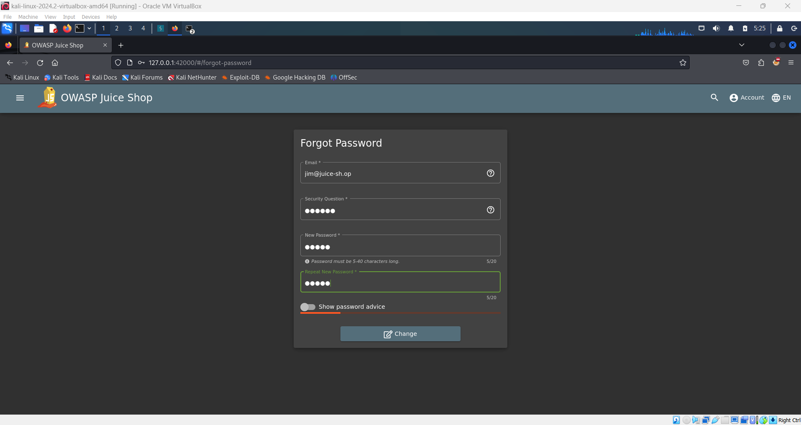
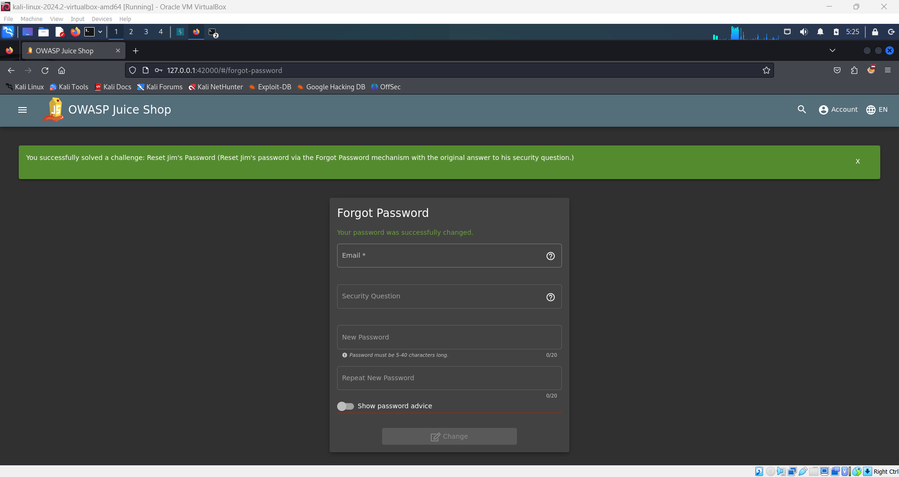

# Reset Jim's Password Challenge 🔐

**Objective**: Reset the password for Jim's account via the Forgot Password mechanism with the original answer to his security question.

## Steps:

1. **Logout from Admin Page**:

   - Log out from the current administrator account.

2. **Navigate to the Login Page**:

   - Go to the login page of the Juice Shop.

3. **Initiate Password Reset**:

   - Click on the **Forgot Password** link.

4. **Enter Jim's Email**:

   - In the email field, type:
     ```plaintext
     jim@juice-sh.op
     ```

5. **Answer the Security Question**:

   - In the security question field with the placeholder **"Your eldest sibling's middle name"**, provide the answer:

     - Through research, you found that Jim is a character from the film series _Star Trek_.
     - His brother’s name is **George Samuel Kirk**.
     - According to family information:
       - **George Kirk** (father)
       - **Winona Kirk** (mother)
       - **George Samuel Kirk** (brother)
       - **Tiberius Kirk** (grandfather)
       - **James** (maternal grandfather)

     The correct answer for the security question is **Samuel**.

6. **Change the Password**:

   - After submitting the correct answer, you will be able to reset the password.
   - Change Jim's password to a new value of your choice. For example:
     ```plaintext
     12345
     ```
     

7. **Complete the Challenge**:

   - Successfully log in to Jim's account using the new password.

     
