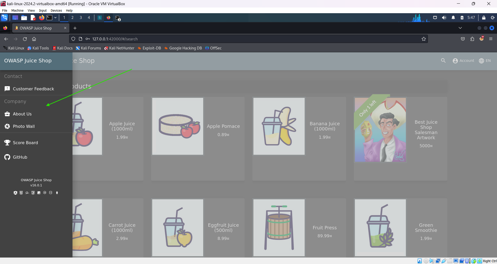
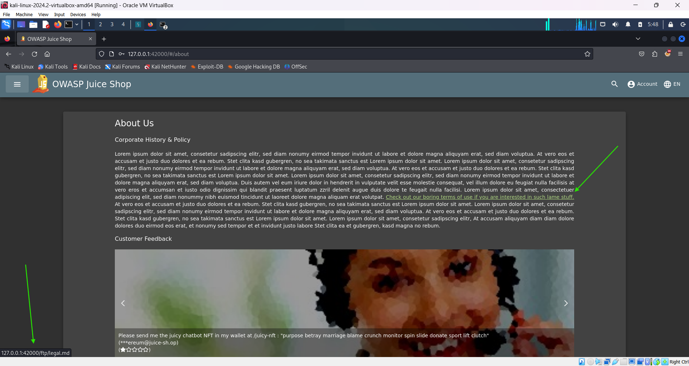
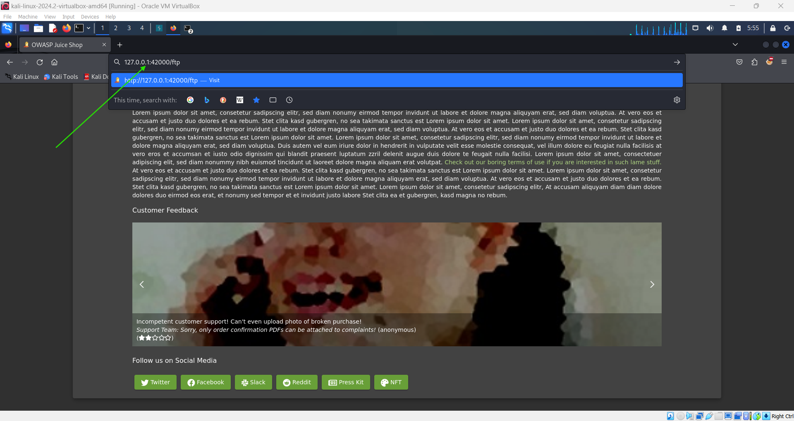
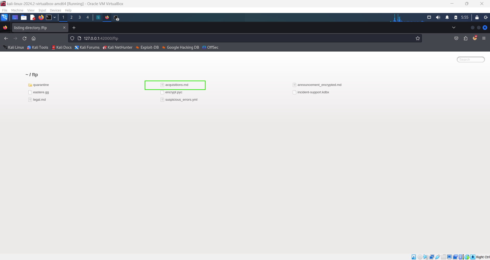
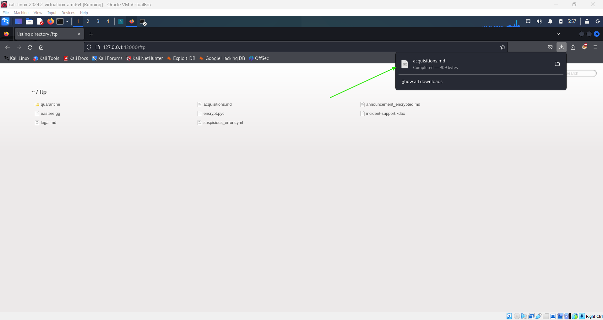
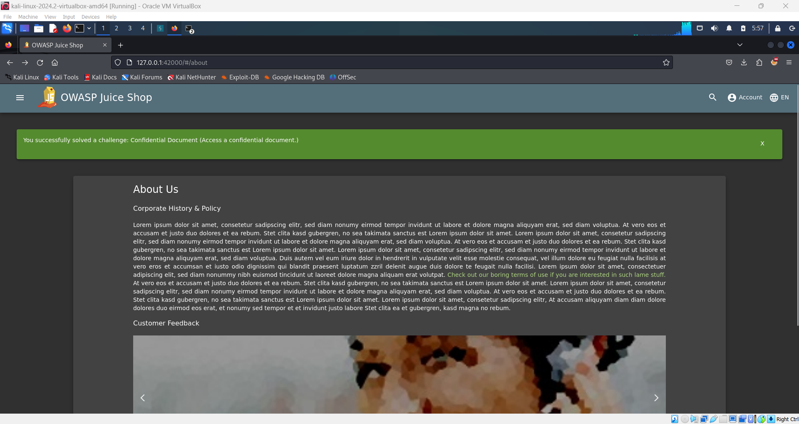

# Access Confidential Document 📂

**Objective**: Access a confidential document and retrieve a flag.

## Steps:

1. **Navigate to the About Us Page**:

   - Open the home menu (burger menu) on the website.
   - Go to the **About Us** section under the **Company** category.

     

2. **Find the Confidential Link**:

   - On the **About Us** page, look for a link that says:
     ```plaintext
     Check out our boring terms of use if you are interested in such lame stuff
     ```
   - Hover over this link to reveal its destination. You should see an IP address indicating an FTP server:
     `plaintext
127.0.0.1:42000/ftp/legal.md
`
     

3. **Access the FTP Server**:

   - Open a new browser tab or window.
   - Type the following address into the address bar:
     ```plaintext
     127.0.0.1:42000/ftp
     ```
   - Press **Enter** to access the FTP server.

     

4. **Download the Confidential Document**:

   - On the FTP server page, locate the file named `acquisitions.md`.
   - Download and save this file to your local machine (just click the file to download).

     

5. **Retrieve the Flag**:

   - After downloading the file, return to the homepage of the Juice Shop.

     

   - You should now receive the flag for completing this challenge.

     
