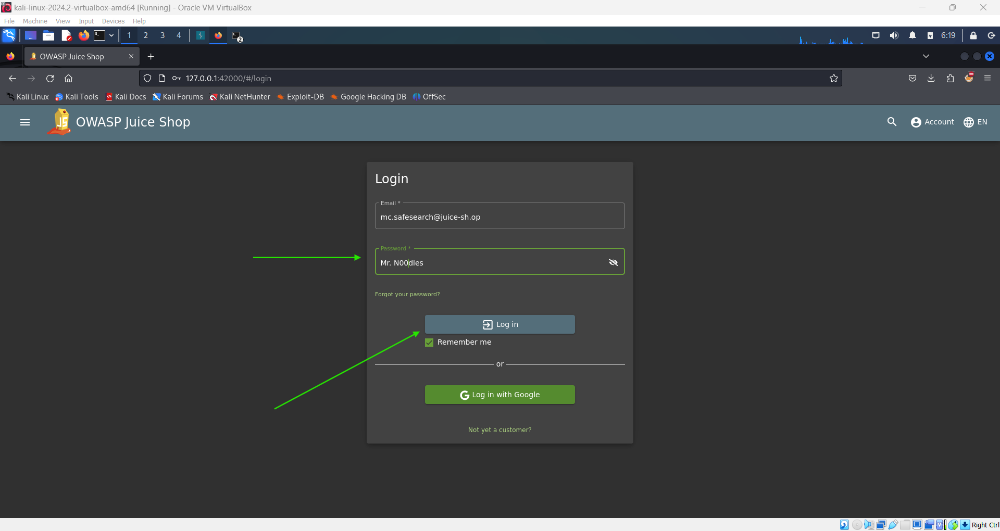
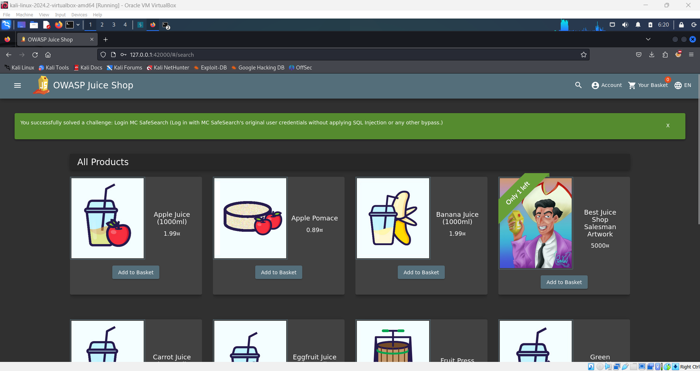

# Log into MC SafeSearch's Account 🎤

**Objective**: Log into the MC SafeSearch account using the provided clues.

## Steps:

1. **Watch the Video**:

   - The challenge involves watching a video where MC SafeSearch provides hints about his password.
   - You can watch the video here: [MC SafeSearch Video](https://youtu.be/v59CX2DiX0Y).

2. **Analyze the Clue**:

   - In the video, MC SafeSearch mentions that his password is **"Mr. Noodles"** but with a twist—he has replaced some vowels with zeros (`0`).
   - Specifically, he replaces the letter `o` with `0`.

3. **Determine the Password**:

   - Using the clue, you deduce that the password for the `mc.safesearch@juice-sh.op` account is:
     ```plaintext
     Mr. N00dles
     ```

4. **Log into MC SafeSearch's Account**:

   - Go to the login page of the Juice Shop.
   - Enter the following credentials:
     - **Username**: `mc.safesearch@juice-sh.op`
     - **Password**: `Mr. N00dles`
   - Successfully log in to complete the challenge.

     

     
