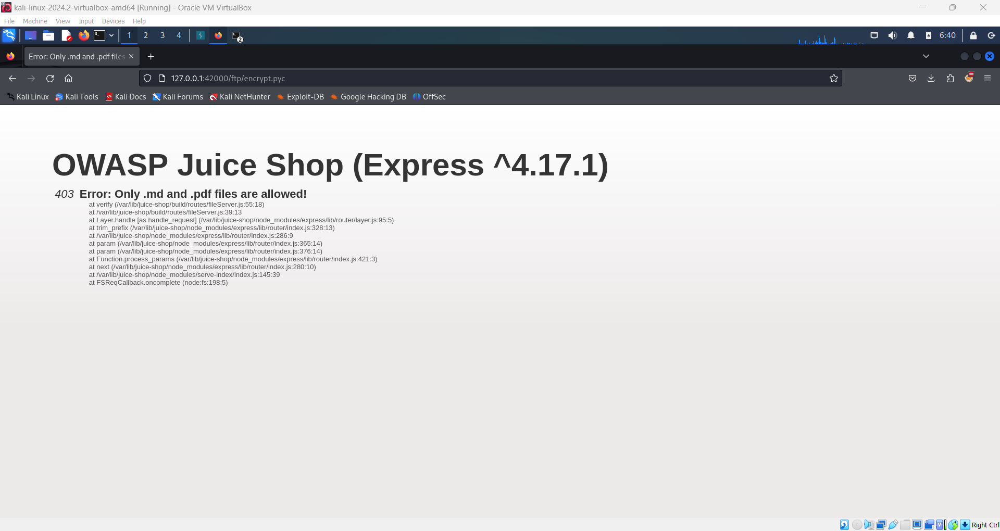
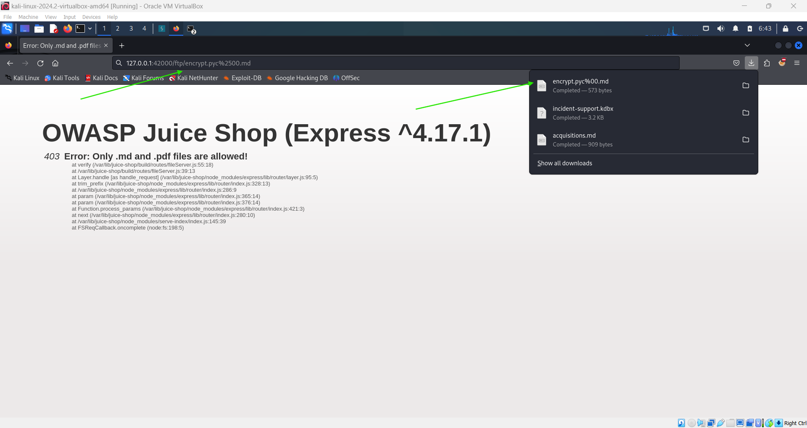
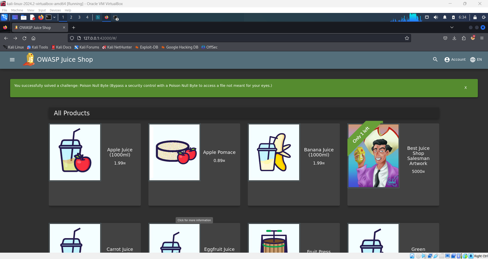

# Poison Null Byte Challenge! 💀

**Objective**: Bypass a security control with a Poison Null Byte to access a file not meant for your eyes. Download the `encrypt.pyc` file using a Poison Null Byte bypass.

## Steps:

1. **Access the FTP Directory**:

   - Navigate to the following URL in your browser:
     ```plaintext
     http://127.0.0.1:42000/ftp/
     ```

2. **Attempt to Download `encrypt.pyc`**:

   - You’ll notice that the server only allows downloading `.md` and `.pdf` files. Attempting to download the `encrypt.pyc` file will result in a restriction error.

     

3. **Bypass the Restriction Using Poison Null Byte**:

   - To bypass the restriction, use a technique known as "Poison Null Byte."
   - A Poison Null Byte is represented as `%00`, but it needs to be URL-encoded, resulting in `%2500`.

4. **Construct the Download URL**:

   - Modify the download URL by appending the encoded null byte and adding `.md` at the end:
     ```plaintext
     http://127.0.0.1:42000/ftp/encrypt.pyc%2500.md
     ```

5. **Download the File**:

   - Use the constructed URL to download the `encrypt.pyc` file. The Poison Null Byte will trick the server into bypassing the restriction and allow the download.

     

6. **Collect Your Flag**:

   - Once the file is downloaded, navigate back to the homepage to collect the new flag.

     
