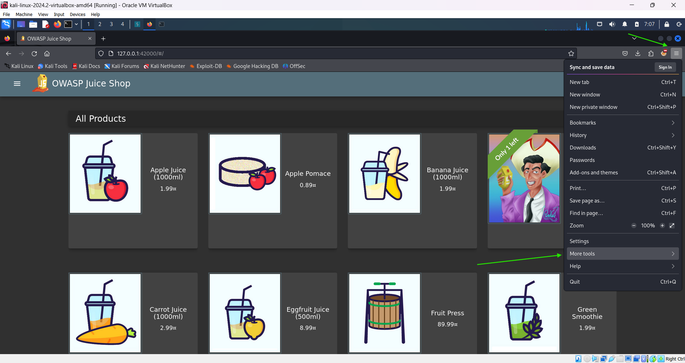
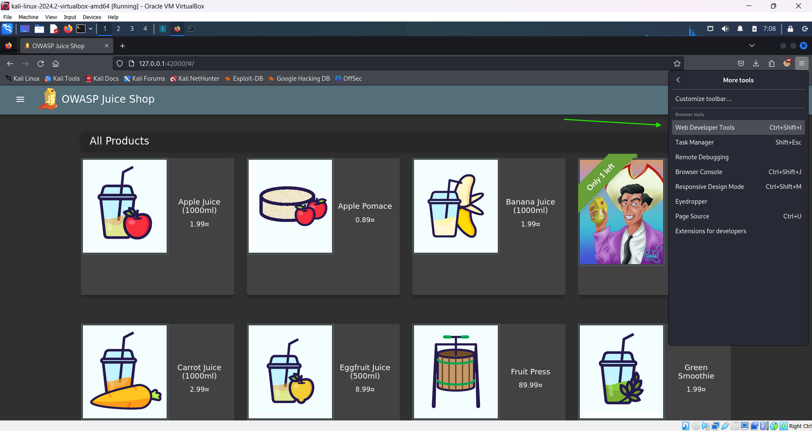
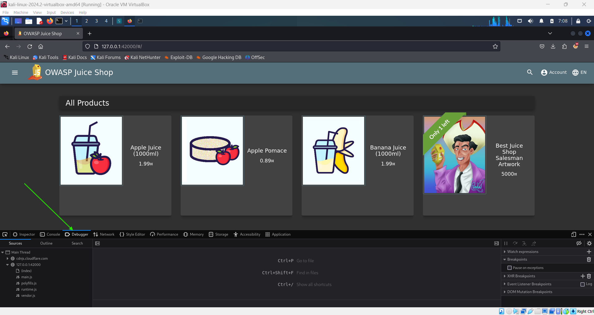
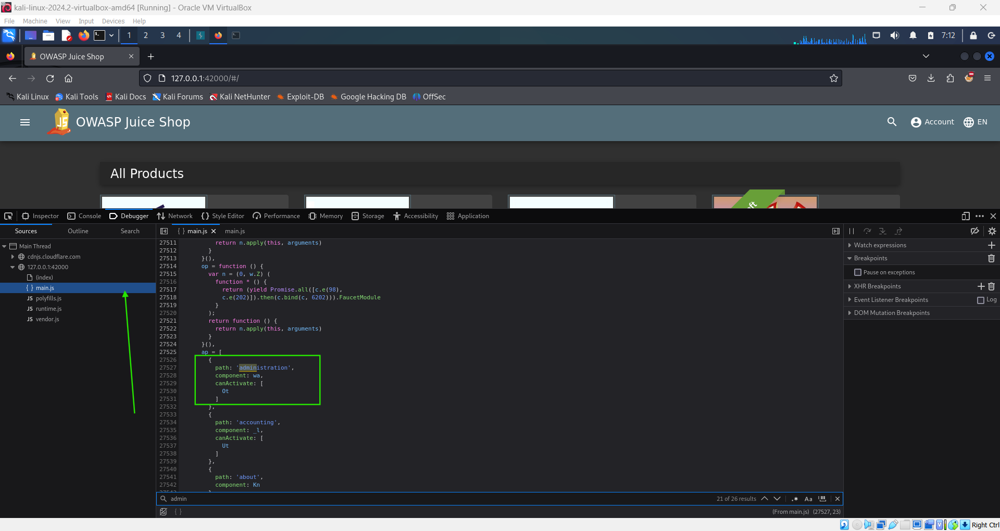
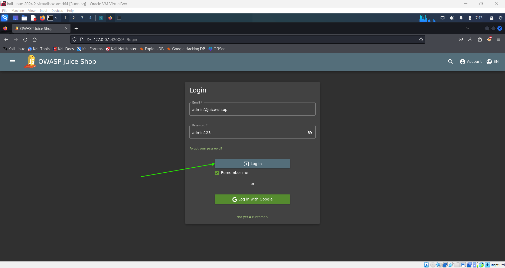
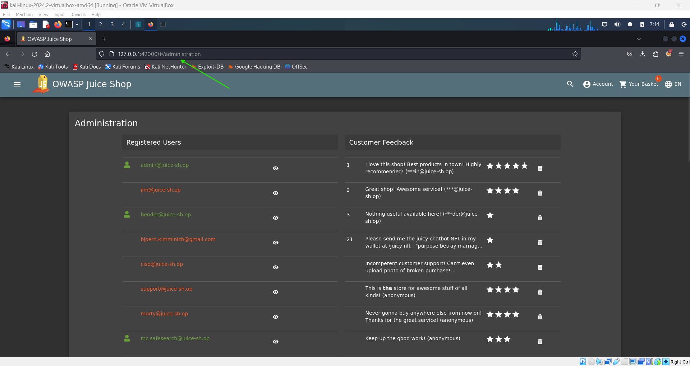

# Access the Administration Section of the Store 🛠️

**Objective**: Access the hidden administration section of the store.

## Steps:

1. **Open the Debugger**:

   - If you're using **Firefox**:

     - Click on the hamburger menu (☰) in the top-right corner.
     - Navigate to **More Tools** and select **Web Developer Tools**.
     - Switch to the **Debugger** tab.

     

     

     

   - If you're using **Chrome**:
     - Open the browser's menu and go to **More Tools**.
     - Select **Developer Tools**, then switch to the **Sources** tab.

2. **Locate the JavaScript File**:

   - Refresh the page to ensure all resources are loaded.
   - In the Debugger (Firefox) or Sources (Chrome), look for a JavaScript file named `main.js`.
   - Click on the file to open it.

3. **Search for the Administration Path**:

   - Click on the **brackets** `{}` at the bottom to make the code more readable (pretty-print the code).
   - Press `Ctrl + F` (or `Cmd + F` on Mac) to open the search function.
   - Search for the term `'admin'`.

4. **Identify the Administration Page**:

   - Look for a code block containing `"path: 'administration'"`.
   - This indicates a route leading to the administration page: `/#/administration`.

     

5. **Attempt to Access the Page**:

   - Open a new browser tab or window and navigate to the following URL:
     ```plaintext
     http://127.0.0.1:42000/#/administration
     ```
   - If you are not logged in as an admin, the page will not load properly.

6. **Log in as an Admin**:

   - To access the administration section, log in with an administrator account.
   - Once logged in, navigate back to the `/administration` URL to view the administration page.

     

     

     

## Security Insight:

- This challenge highlights the importance of only loading parts of the application that are necessary for the user’s role. By limiting access, you can prevent unauthorized users from viewing sensitive information like the admin page.
