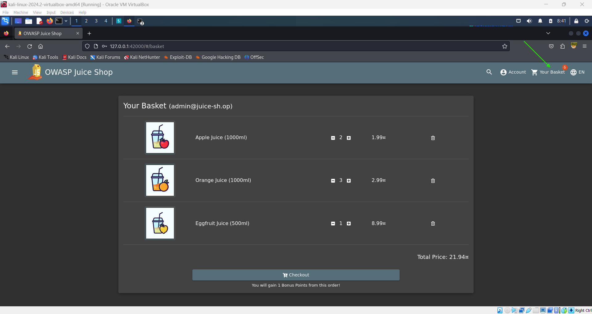
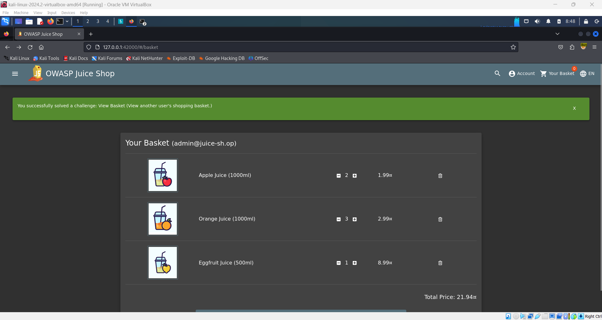

# View Another User's Shopping Basket 🛒

**Objective**: Access and view the shopping basket of another user by intercepting and modifying a request.

## Steps:

1. **Log in to the Admin Account**:

   - Begin by logging into the administrator account on the Juice Shop platform.

     

2. **Capture the Request with Burp Suite**:

   - Ensure Burp Suite is running and intercepting traffic.

     

   - Click on **'Your Basket'** within the Juice Shop to trigger the request for the basket contents.

     

   - Burp Suite will capture the request.

3. **Identify the Basket Request**:

   - In Burp Suite, forward each request until you see the following request:
     ```plaintext
     GET /rest/basket/1 HTTP/1.1
     ```
   - The number `1` after `/basket/` represents your current user ID.

     

4. **Modify the User ID**:

   - Change the `1` to another number, such as `2`, in the request URL:
     ```plaintext
     GET /rest/basket/2 HTTP/1.1
     ```
   - Forward the modified request in Burp Suite.

   

5. **View the Other User's Basket**:

   - The response should now display the contents of User ID `2`'s basket.
   - You can repeat this process with different user IDs to view their baskets, provided those users have items in their baskets.

     
