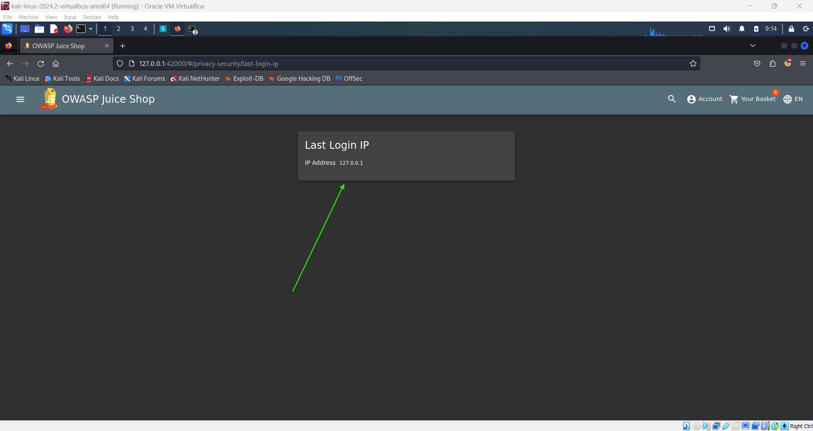
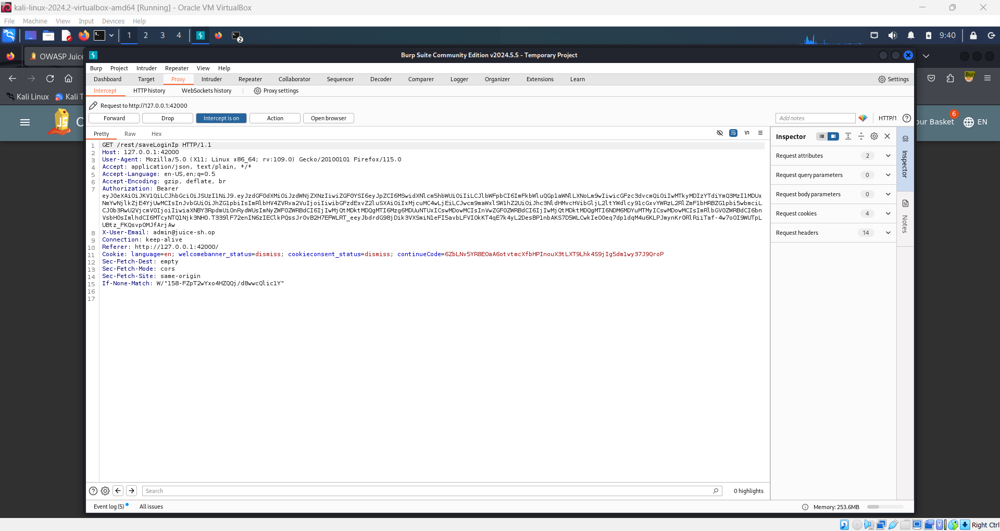
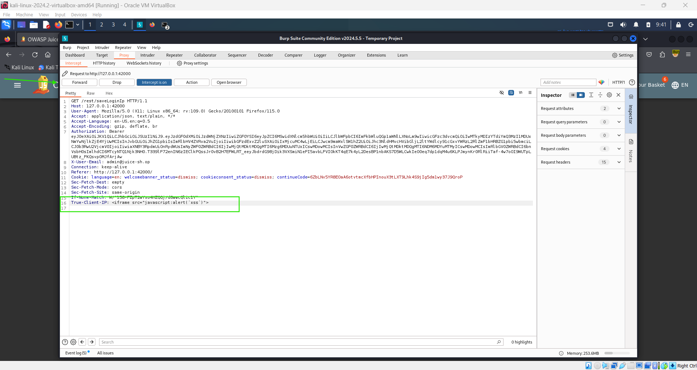

# Perform a Persistent XSS Attack 🚨

**Objective**: Perform a persisted XSS attack with <iframe src="javascript:alert(`xss')"> through an HTTP header.(This challenge is potentially hamrful on Docker!).

## Steps:

1. **Log in to the Admin Account**:

   - Begin by logging into the administrator account on the Juice Shop platform.

2. **Navigate to the 'Last Login IP' Page**:

   - Once logged in, go to the **"Last Login IP"** page. Here, you should see the last recorded IP address, typically something like `0.0.0.0` or `10.x.x.x` which in our case is `127.0.0.1`.

   

   

3. **Prepare for the Attack**:

   - The objective is to manipulate the "Last Login IP" field by injecting a script that will execute each time the page is loaded.
   - First, log out of the admin account. This will trigger the system to log a new IP address.

4. **Intercept the Logout Request with Burp Suite**:

   - Ensure that Burp Suite is running and intercepting traffic.
   - Log out of the admin account, and Burp Suite will capture the logout request. Forward until u see the following request or that looks like it.

   

5. **Modify the Request to Inject the XSS Payload**:

   - In Burp Suite, go to the **Headers** tab of the captured logout request.
   - Add a new header at the end with the following content:

     ```plaintext
     True-Client-IP: <iframe src="javascript:alert(`xss`)">
     ```

   - This header will inject the XSS payload into the "Last Login IP" field.

6. **Forward the Modified Request**:

   - Forward the modified request in Burp Suite to complete the logout process with the injected payload.

   

7. **Verify the XSS Attack**:
   - Log back into the admin account and navigate to the "Last Login IP" page.
   - If the attack is successful, the script will execute, and you should see an alert pop up on the screen with the message `xss`.

## Security Insight:

- This challenge demonstrates the dangers of persistent XSS attacks, where malicious scripts are stored on the server and executed every time a user accesses the affected page. Proper input sanitization and validation are crucial to prevent such attacks.
