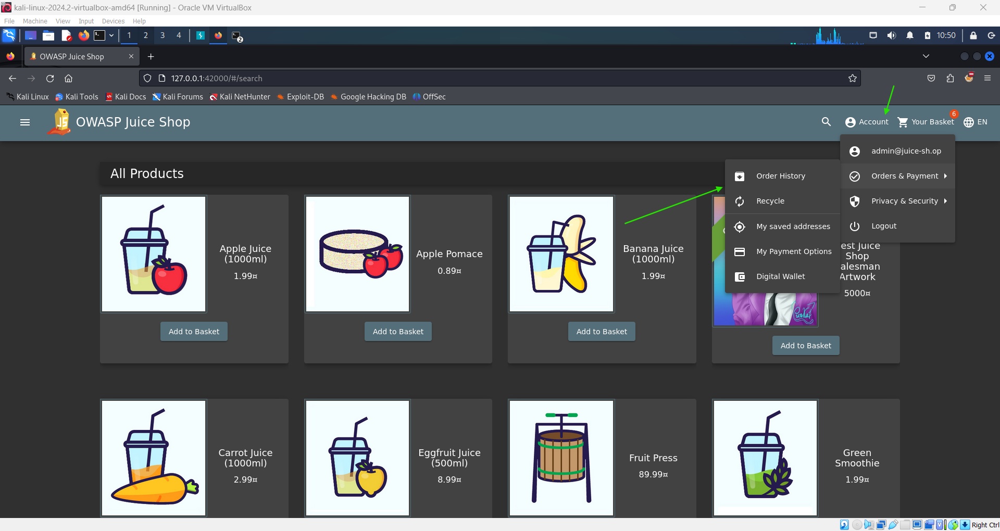
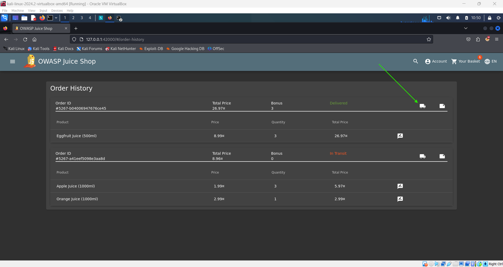
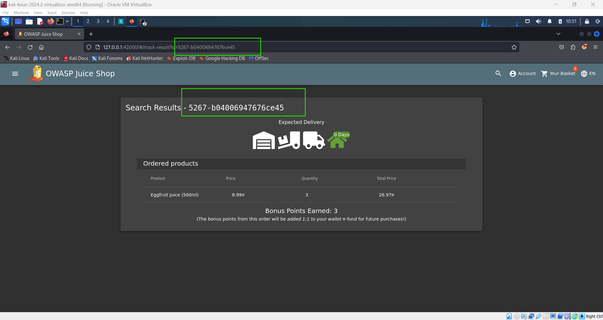
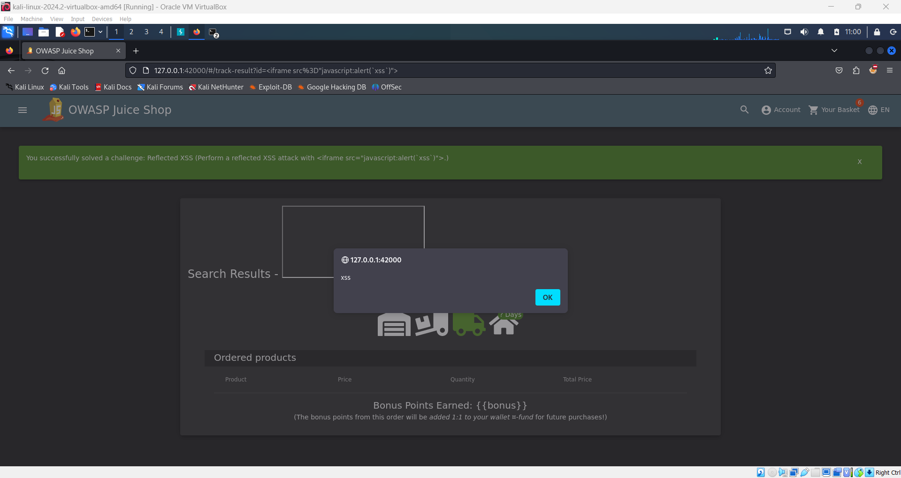

# Perform a Reflected XSS Attack 🔄

**Objective**: Exploit a reflected cross-site scripting (XSS) vulnerability in the Juice Shop application to inject and execute a script via a URL parameter.

## Steps:

1. **Log in to the Admin Account**:

   - Begin by logging into the administrator account on the Juice Shop platform.

2. **Navigate to the 'Order History' Page**:

   - Once logged in, go to the **'Order History'** page. Here, you will see a list of past orders, each accompanied by a "Truck" icon for tracking.

     

3. **Access the Track Result Page**:

   - Click on the "Truck" icon next to any order. This will take you to the **Track Result** page, where you'll see a URL containing an `id` parameter corresponding to the order.

     

     

4. **Inject the XSS Payload**:

   - Replace the value of the `id` parameter in the URL with the following XSS payload:
     ```plaintext
     <iframe src="javascript:alert(`xss`)">
     ```
   - The modified URL should look something like this:
     ```plaintext
     http://127.0.0.1:42000/#/track-result?id=<iframe src="javascript:alert(`xss`)">
     ```
   - Submit the modified URL.

5. **Trigger the XSS Attack**:

   - After submitting the URL, refresh the page. If the attack is successful, an alert box with the message `xss` will pop up, confirming the reflected XSS.

     

## Why Does This Work?

- Reflected XSS occurs when user-supplied data in a URL parameter is immediately reflected back in the web page without proper sanitization or validation. In this case, the `id` parameter is not sanitized before being processed by the server, allowing the injected script to execute.

## Security Insight:

- This challenge highlights the importance of input validation and output encoding. By failing to sanitize the `id` parameter, the application becomes vulnerable to reflected XSS attacks, which can be exploited by attackers to run arbitrary scripts in the context of the user's session.
