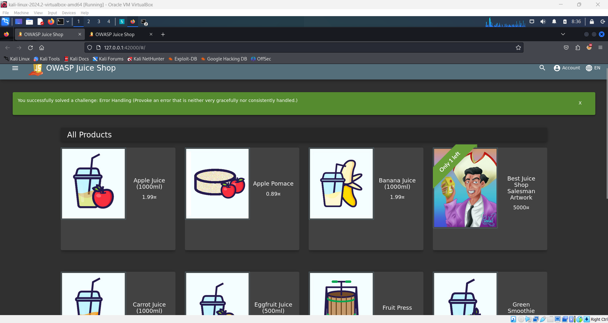

# Provoke an Error for Information Disclosure 🚨

**Objective**: Identify and provoke an error in the OWASP Juice Shop that reveals excessive or unintended information, often due to improper error handling.

## Overview:

The OWASP Juice Shop, while robust in its security features, may still display error messages that reveal more information than intended. This type of vulnerability can expose the application's configuration, internal workings, or even user data. By deliberately causing errors, you can uncover valuable insights that could be exploited in further attacks.

## Steps to Provoke an Error:

1. **Tamper with Form Inputs**:

   - Attempt to submit invalid or unexpected data in various forms across the Juice Shop application.
   - For example, try entering large numbers, special characters, or even SQL injection-like inputs in fields that might not expect them.

2. **Manipulate URL Paths and Parameters**:

   - Directly modify the URL in your browser’s address bar to include invalid paths or parameters.
   - Examples:
     - Change a product ID in the URL to a negative number or a string of characters.
     - Add random parameters to the URL to see if they cause an error.

3. **Use the Browser's Developer Tools**:

   - Keep your browser’s JavaScript console open (F12 or right-click > "Inspect").
   - Many errors, especially those that do not display on the page, might be logged in the console. Look for any error messages or stack traces that appear there.

4. **Watch for Detailed Error Messages**:

   - If you provoke an error successfully, the application might display a detailed error message. This message could reveal information like database queries, stack traces, or specific details about the server environment.

5. **Common Areas to Test**:
   - **Login Forms**: Try submitting unexpected data like a large string or invalid email format.
   - **Product Pages**: Modify product IDs in the URL.
   - **API Endpoints**: If you can identify any API calls (visible in the Network tab of Developer Tools), try altering the parameters or sending unexpected data.

## What to Look For:

- **Detailed Error Messages**: These could contain information about the server, database queries, or the codebase.
- **Stack Traces**: These often reveal the internal structure of the application and could hint at vulnerable components.
- **Unexpected Behavior**: Any behavior that seems odd or unintended could be a sign of a deeper vulnerability.

## Example Scenario:

You change the product ID in a URL to a string of letters instead of numbers:

```plaintext
http://127.0.0.1:42000/#/product/abc123
```

If this triggers an error, the application might display a stack trace or a detailed error message, inadvertently revealing information about its backend.

## Security Insight:

Errors that leak too much information can be dangerous. Attackers can use this information to understand how the application works internally and craft more sophisticated attacks. Ensuring that the application handles errors gracefully and consistently is crucial for maintaining security.

By successfully provoking an error and observing the information it discloses, you can gain a better understanding of how the OWASP Juice Shop might be vulnerable to improper error handling.


