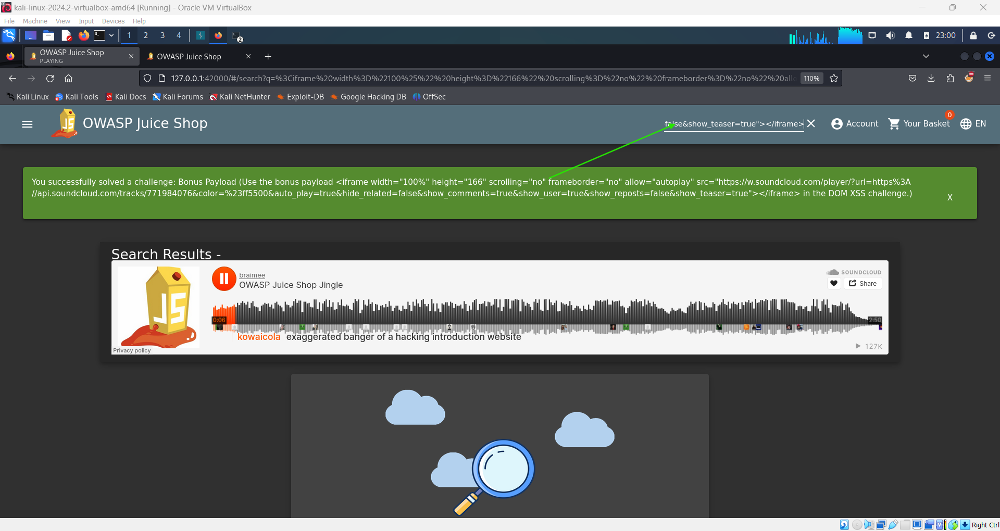

# Bonus Payload Challenge 🎵

## Objective

The goal of this challenge is to test the application's input sanitization by injecting a multimedia payload. By exploiting the search bar's vulnerability, you can embed external content into the application, demonstrating its susceptibility to attacks like Cross-Site Scripting (XSS).

## Instructions

To complete this challenge, paste the following payload into the search bar located on the navbar:

```html
<iframe
  width="100%"
  height="166"
  scrolling="no"
  frameborder="no"
  allow="autoplay"
  src="https://w.soundcloud.com/player/?url=https%3A//api.soundcloud.com/tracks/771984076&color=%23ff5500&auto_play=true&hide_related=false&show_comments=true&show_user=true&show_reposts=false&show_teaser=true"
></iframe>
```

This will embed a SoundCloud player into the page and trigger the **Bonus Payload** challenge!


