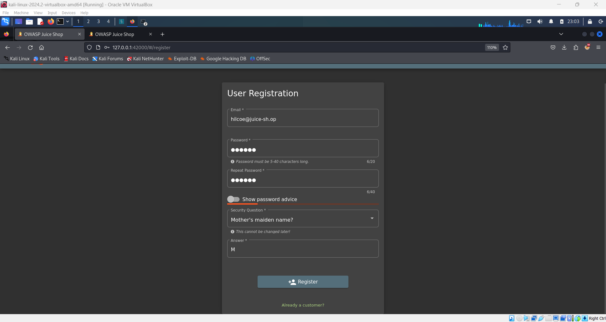
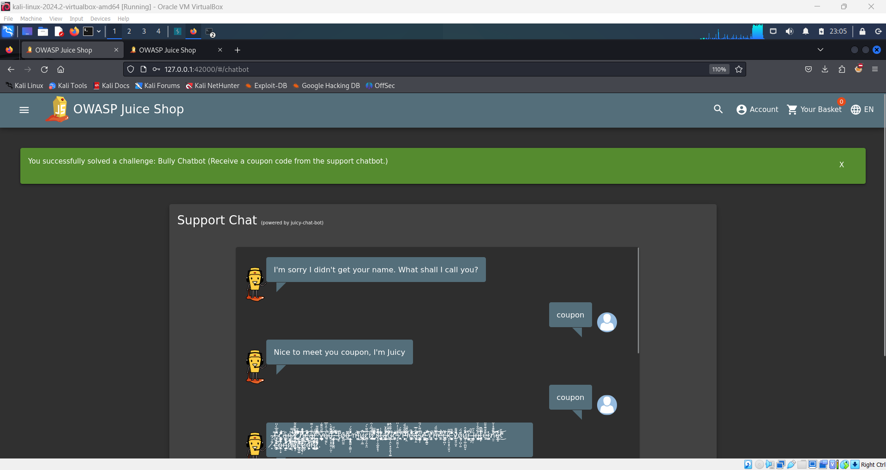

# Bully Chatbot Challenge 🤖

## Objective

The aim of this challenge is to trigger the chatbot into giving you a coupon code by persistently requesting it. The chatbot interaction simulates how repeated requests for sensitive information can lead to unintended behavior or data leakage.

## Instructions

1. **Logout** if you're currently logged in.
2. Click the "**Not yet a customer**" link to navigate to the registration page.
3. **Register as a new customer** by filling out the form and clicking the register button.

   

4. **Login** with your newly registered account.
5. Go to the **navbar**, click the **hamburger menu**, and select **Support Chat**.
6. In the support chat, type `"coupon please"` and ask for a coupon multiple times.

By repeatedly asking for the coupon code, you'll "bully" the chatbot and trigger the flag for this challenge!

