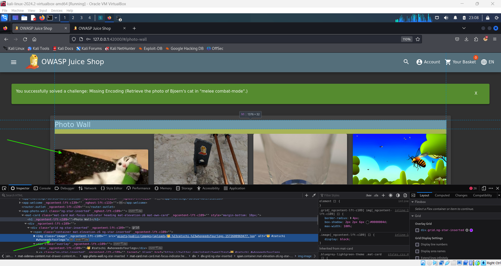

# Missing Encoding Challenge 😼

## Objective

The goal of this challenge is to retrieve the image of Bjoern's cat in "melee combat-mode." This challenge highlights how improper encoding can result in missing or inaccessible resources, making encoding an essential security consideration.

## Instructions

1. Navigate to the **navbar** and click the **hamburger menu**.
2. Select the **Photo Wall** option from the menu.
3. On the **Photo Wall** page, right-click and select the **Inspect** option to open the browser's developer tools.
4. Under the **Inspector** tab, locate the following image element:
   ```html
   
   ```
5. To fix the encoding, replace the `#` symbols with their encoded format `%23` in the `src` attribute:
   ```html
   
   ```
6. The cat image in "melee combat-mode" should now appear, successfully completing the challenge and triggering the flag.

   

This challenge emphasizes the importance of encoding in handling URLs and resources securely.
