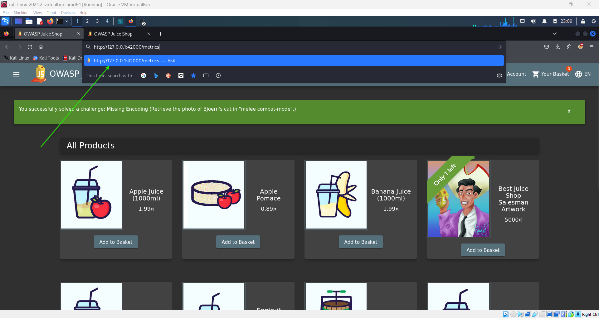
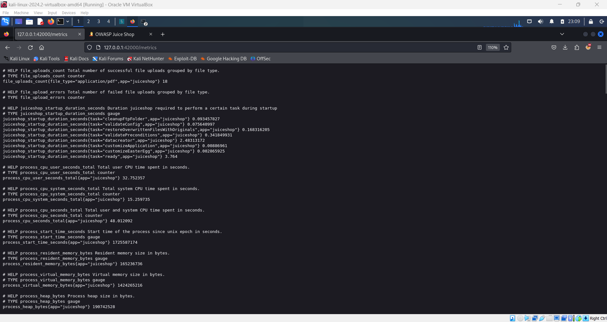
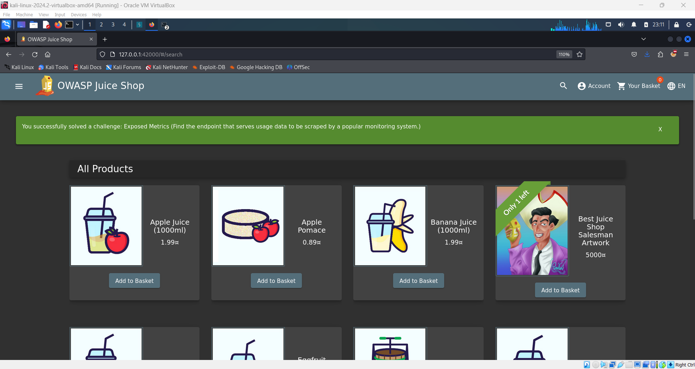

# Exposed Metrics Challenge 📊

## Objective

The goal of this challenge is to find and access an exposed endpoint that serves sensitive usage data for monitoring purposes. This challenge demonstrates the risks of leaving internal metrics exposed to unauthorized users.

## Instructions

1. Open your browser and navigate to the address bar.
2. Type the following URL and press **Enter**:
   ```
   http://127.0.0.1:42000/metrics
   ```
3. This will expose sensitive data meant for a monitoring system.

   

4. Once accessed, the challenge will be marked as complete, and you will see the green flag when you return to the homepage.

   

   

This challenge shows how important it is to secure internal metrics endpoints from unauthorized access.
