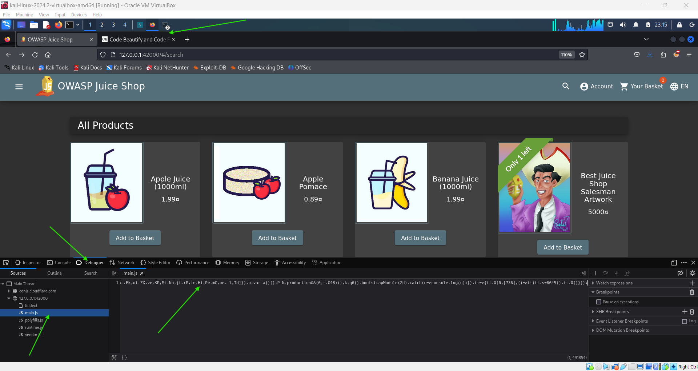
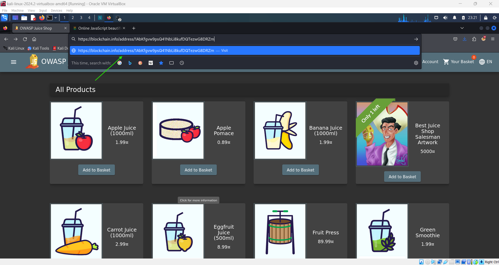
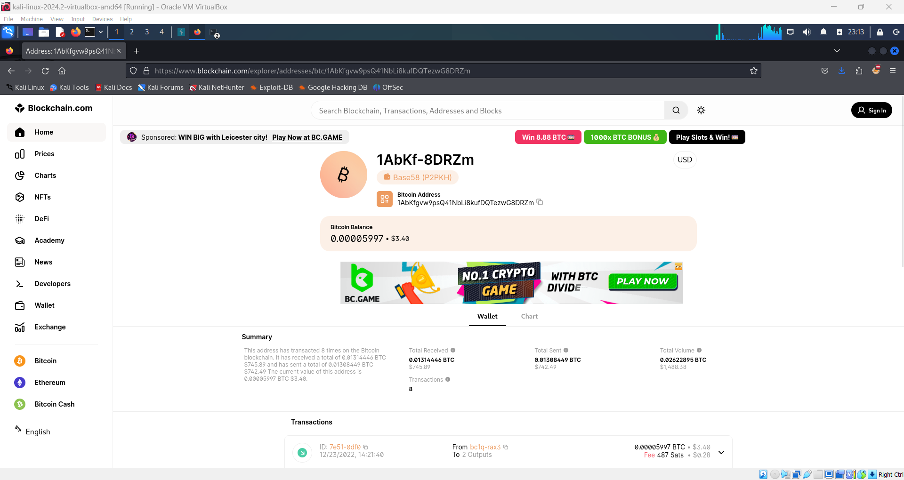

# Outdated Allowlist Challenge 🪙

## Objective

The goal of this challenge is to find and redirect to a deprecated cryptocurrency address that is no longer promoted by the application, highlighting the dangers of outdated allowlists. This demonstrates how sensitive or outdated information can still be present in an application's codebase.

## Instructions

1. Go to the homepage of the OWASP Juice Shop.
2. Right-click anywhere on the page and select **Inspect**.
3. In the **Debugger** tab, locate the `main.js` file and copy the entire script.
4. Use an online code beautifier (e.g., [Code Beautify](https://codebeautify.org)) to make the script readable.

   

5. Search for the term **'blockchain'** within the script to locate the outdated cryptocurrency address.
6. Once found, go back to the Juice Shop and use the search bar to paste the address in this format:

   ```
   https://blockchain.info/address/1AbKfgvw9psQ41NbLi8kufDQTezwG8DRZm
   ```

   

7. This will take you to Blockchain.com, completing the challenge.

   

   

## Description

This challenge showcases the risks associated with outdated or unmaintained allowlists that still permit access to sensitive or deprecated resources. It serves as a reminder to regularly audit and update any allowlists used within an application to ensure they are still relevant and secure.
