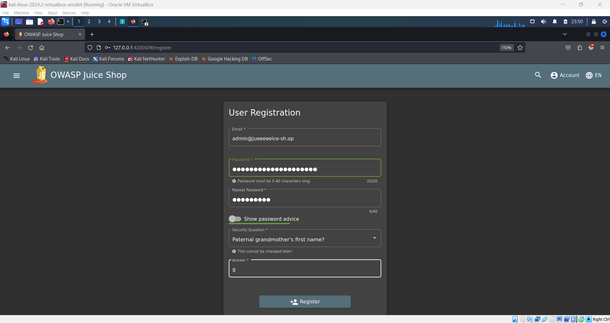
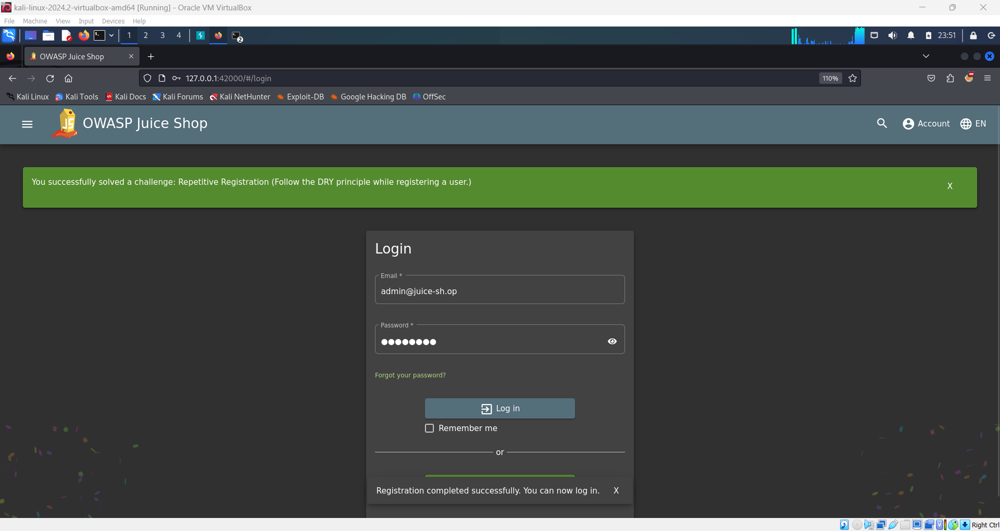

# Repetitive Registration Challenge 🔄

## Objective

Bypass the **Don't Repeat Yourself (DRY)** principle by submitting the same registration information multiple times, revealing vulnerabilities related to repetitive actions in the registration process.

## Instructions

1. Go to the **registration** page on OWASP Juice Shop.
2. Create a new account by filling in the email and other required fields.
3. For the password:

   - First, type in a password.
   - In the "repeat password" field, enter the same password until the validation shows green.
   - After validation, change the first password and then hit **Register**.

     

4. After registration, the challenge will be marked as completed, and you’ll receive the green flag.

   

## Description

This challenge demonstrates how an application may fail to properly validate or check for password consistency before submission. It highlights the importance of maintaining unique constraints and ensuring that security measures are enforced, especially in the user registration process.
