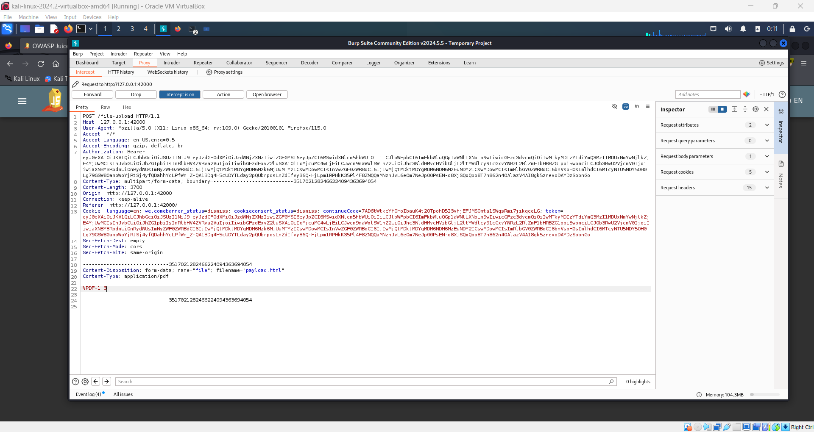

# Deprecated Interface Challenge 🕵️‍♂️

## Objective

The aim of this challenge is to exploit a deprecated B2B interface that has not been properly shut down, highlighting issues related to security misconfiguration and improper handling of file uploads.

## Instructions

1. **Login** to your OWASP Juice Shop account if you are not already logged in.
2. On the **home page**, navigate to the **Compliant** option from the hamburger menu in the navbar.
3. Prepare two files named `payload.pdf` and `payload.html`, placing them in the same directory on your system.
4. **Enable Burp Suite** in your browser using the FoxyProxy extension.

   

   

5. Fill in the complaint form with your **message** (e.g., "hello world").
6. For the invoice upload, select the `payload.pdf` file from the directory you created.
7. Before the file reaches the server, it will be captured in Burp Suite.

   - Go to the **Proxy** tab in Burp Suite and find the intercepted request.

     

   - In the intercepted request, replace the `payload.pdf` file with the `payload.html` file.
   - Remove the contents of the `.pdf` file, leaving only the PDF header. This will trick the server into believing it's still a PDF.

     

   - Right-click on the request and select "Do Intercept" > "Response to this request".
   - Click **Forward** to send the modified response.

8. After the request is forwarded, you should see a success message "2".
9. Click **Forward** once more to complete the process.

## Description

This challenge demonstrates a security misconfiguration issue where an outdated and deprecated interface remains operational, allowing for potential exploitation. By manipulating file uploads and using Burp Suite to intercept and modify requests, you can bypass certain security controls and successfully complete the challenge.
