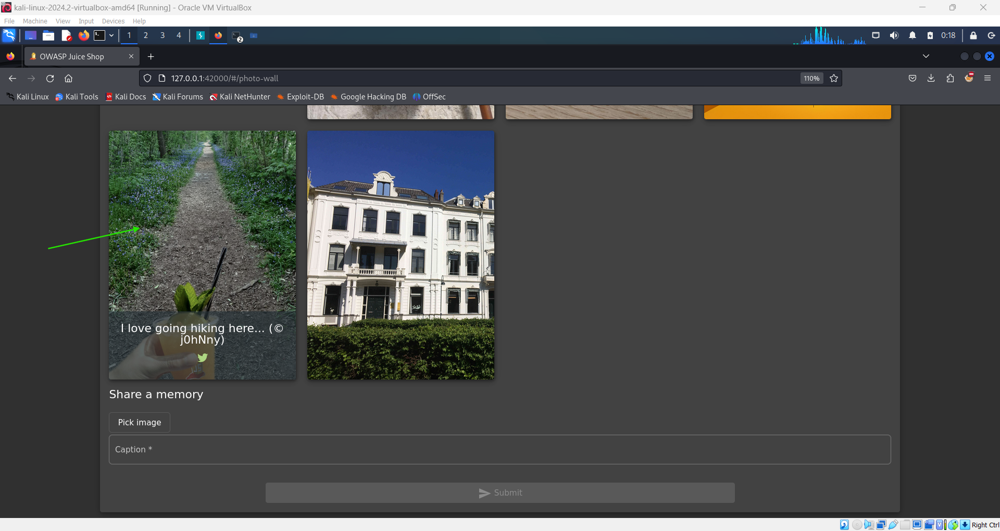
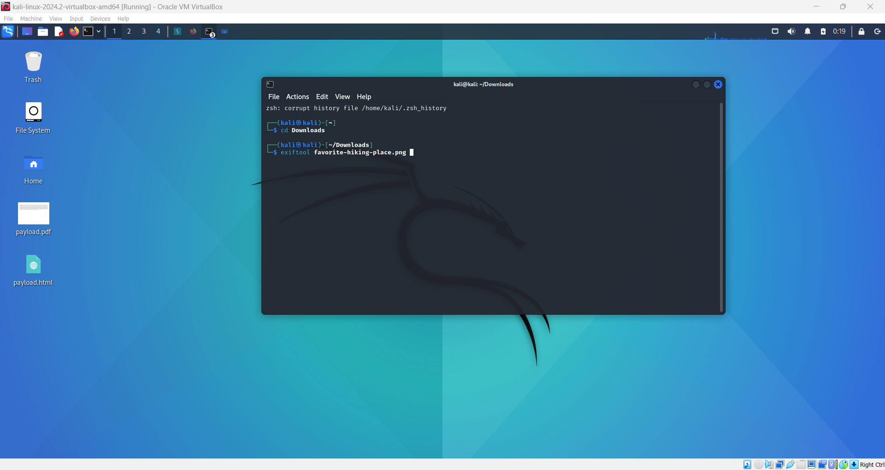
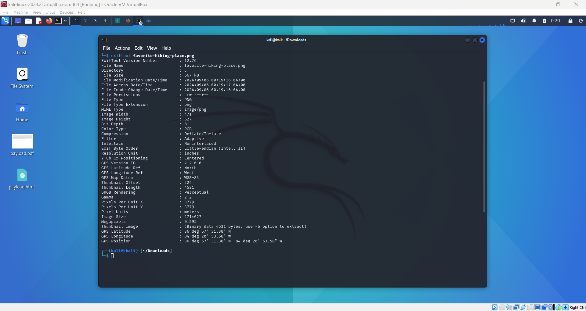
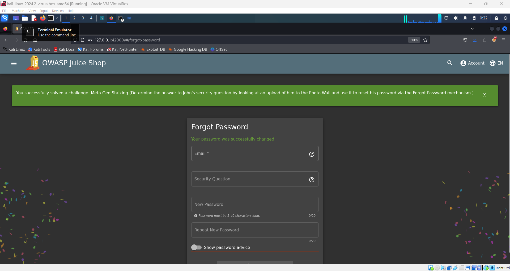

# Meta Geo Stalking Challenge 🌍

## Objective

The goal of this challenge is to expose sensitive data through open source information gathering. You will use EXIF data from an image to identify a location and answer a security question to reset a password.

## Instructions

1. **Locate the Username**: The username for the account you need to access is `john@juice-sh.op`.

2. **Find the Security Question**: The security question for resetting John's password is: "What's your favourite place to go hiding?"

3. **Download the Image**:

   - Navigate to the **Photo Wall** page.
   - Locate and download an image posted by John.

     

4. **Extract EXIF Data**:

   - Open a terminal on Kali Linux (or your preferred OS).
   - Navigate to the directory where you downloaded the image.
   - Run the following command to extract EXIF data:
     ```bash
     exiftool favourite-hiking-place.png
     ```
   - This command will reveal GPS coordinates embedded in the image.

     

     

5. **Identify the Location**:

   - Use the extracted GPS coordinates to identify the location. You can use Google Maps or AI tools like GPT or Gemini for this purpose.
   - The coordinates `36°57'31.4"N 84°20'53.6"W` will lead you to "Scuttlehole Trailhead."

6. **Attempt Password Reset**:

   - Go to the **Forgot Password** page.
   - Answer the security question with "Scuttlehole Trailhead."
   - Choose a new password (e.g., "12345") and submit.

7. **Correct the Location**:

   - If the initial answer is incorrect, refine your search to find the accurate location.
   - Search for the phrase "Scuttlehole Trailhead located at" to find more information.
   - The correct location is "Daniel Boone National Forest."

8. **Reset Password with Correct Answer**:

   - Use "Daniel Boone National Forest" as the answer to the security question.
   - Set a new password and complete the reset process.

9. **Success**:

   - Once you reset the password correctly, you will successfully pass the challenge and receive the green flag.

     

## Description

This challenge illustrates how sensitive data can be uncovered through metadata in images. By leveraging EXIF data, you can discover location information and answer security questions that use this data. This highlights the importance of securing metadata and being cautious with the information shared in images.
