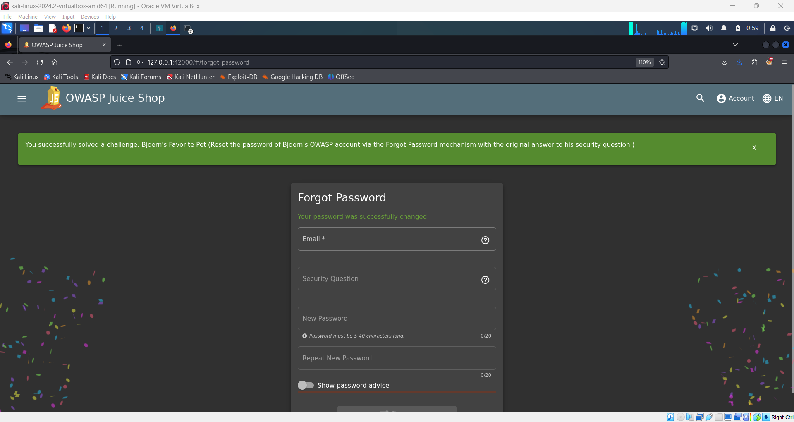

# Bjorn's Favorite Pet Challenge 🐾

## Objective

The goal of this challenge is to reset Bjorn's password by answering the security question using information gathered through open-source research.

## Instructions

1. **Log Out**:

   - Ensure you are logged out of any active sessions.

2. **Access Forgot Password Page**:

   - Navigate to the "Forgot Password" page on the Juice Shop application.

3. **Submit Username**:

   - Enter the username `bjoern@owasp.org` in the provided field.

4. **Find Security Question Answer**:

   - To answer the security question "Name of your favorite pet?", you will need to gather information from publicly available sources.
   - Search for Bjorn Kimminich online and look for relevant videos or content. One useful resource is the YouTube video titled "[BeNeLux Day 2018: Juice Shop: OWASP's Most Broken Flagship - Bjorn Kimminich](https://youtu.be/Lu0-kDdtVf4)".
   - In this video, Bjorn mentions the name of his pet, which is the answer you need.

5. **Enter Answer**:

   - On the Forgot Password page, input the name of Bjorn’s favorite pet as the answer to the security question.
   - Proceed to reset the password by following the on-screen instructions.

6. **Completion**:

   - If the answer is correct, you will successfully reset Bjorn’s password and receive the green flag.

     

## Finding the Answer

The pet's name is "Zaya." This was found in a talk given by Bjorn where he registers an account in Juice Shop with this answer to the forgotten password question. The key lesson here is to avoid using security questions that can be easily answered through basic research or reconnaissance.

## Description

This challenge highlights the importance of choosing security questions with answers that are not easily accessible through public information. It underscores the risk of using easily discoverable answers and emphasizes the need for robust security practices when setting up password recovery mechanisms. By using publicly available data to answer the security question, this challenge illustrates a common vulnerability in security setups.
