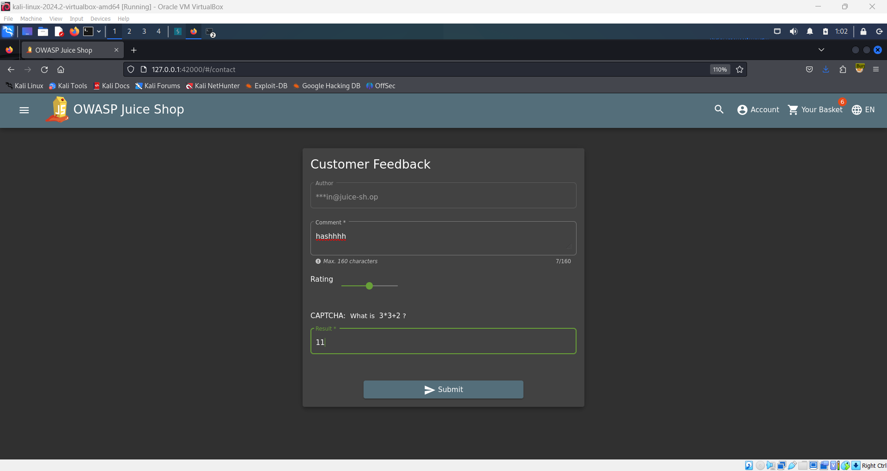
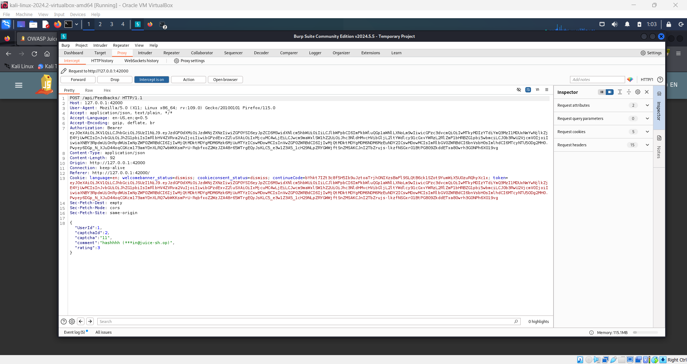
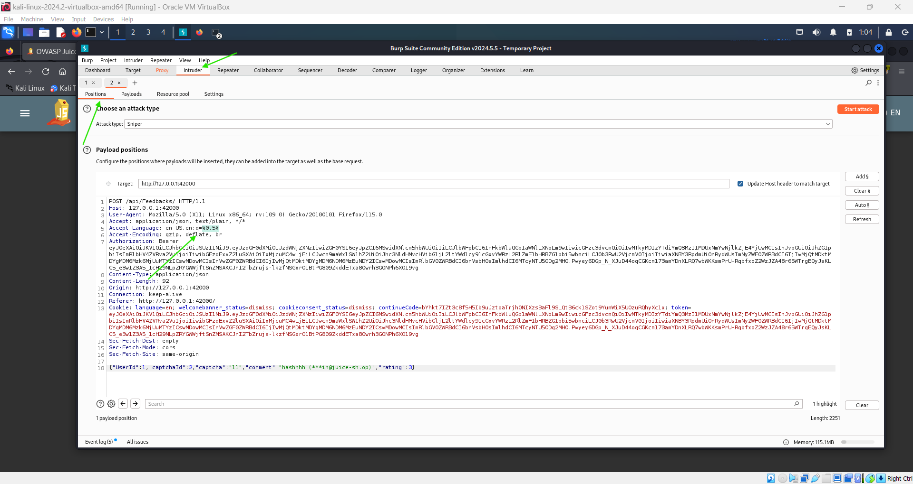
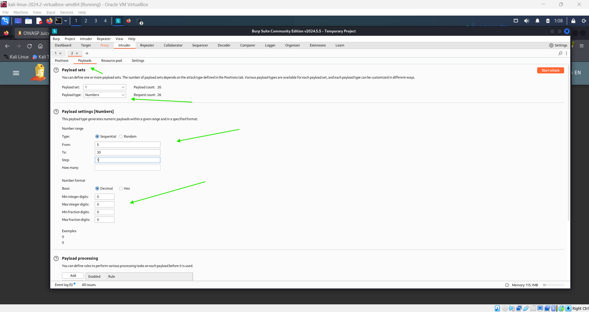
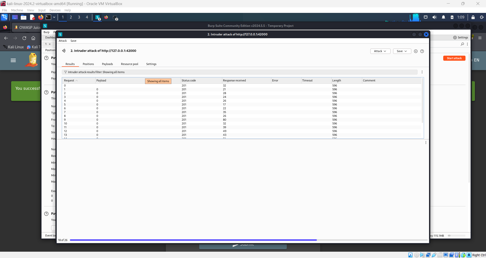
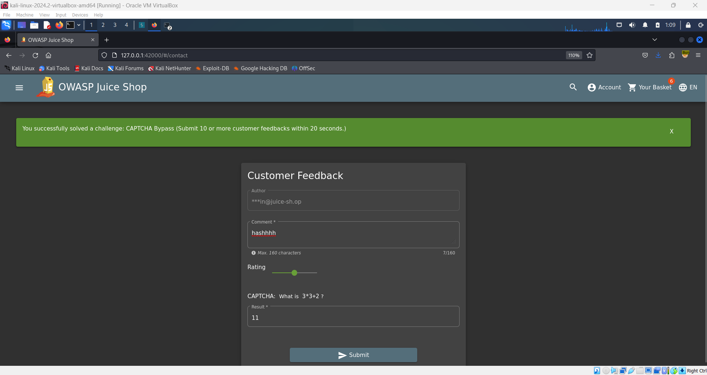

# Captcha 🤖

**Objective:**

Bypass the CAPTCHA by submitting 10 or more customer feedback forms within 20 seconds.

## Steps to Complete:

1. **Access the Feedback Form:**

   - Navigate to the feedback form on the website.

2. **Enable Burp Suite Interception:**

   - Turn on interception in Burp Suite.
   - Configure Burp Suite to work with FoxyProxy.

3. **Fill Out the Form:**

   - Enter a comment in the comment text area.
   - Adjust the rating slider as needed.
   - Complete the CAPTCHA field.

4. **Submit Feedback:**

   - Click the submit button.

     

## Brute Force Submission:

1. **Intercept the Request:**

   - Burp Suite will capture the feedback submission request.

     

2. **Send to Intruder:**

   - Right-click the intercepted request in Burp Suite and select "Send to Intruder."

3. **Configure Intruder:**

   - Choose the position for payload injection in the request.

     

   - Select a payload type (e.g., numbering) to automate multiple submissions.

     

4. **Start the Attack:**

   - Initiate the attack to send multiple requests.

     

## Completion:

After executing the brute force attack and successfully submitting at least 10 feedback forms within the 20-second window, the challenge will be marked as complete, and you should see a green flag.

