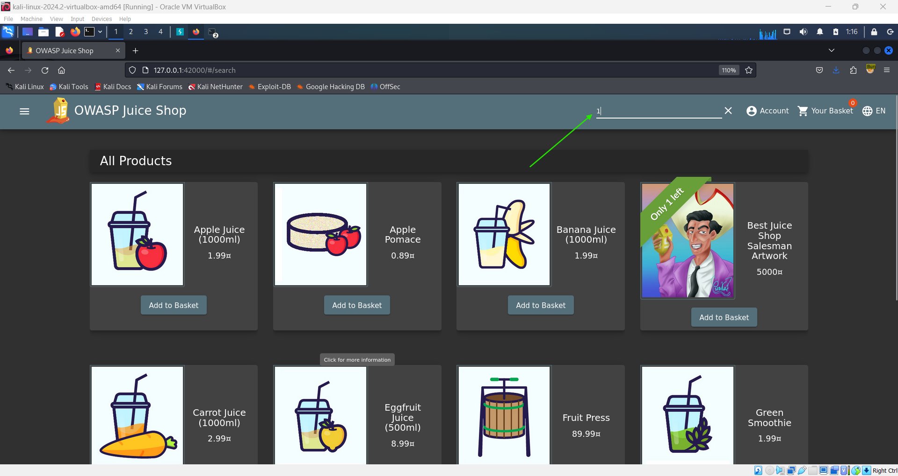

# Database Schema 🗃️

**Objective:**

Exfiltrate the entire database schema definition via SQL Injection.

## Steps to Complete:

1. **Setup Burp Suite:**

   - Ensure Burp Suite interception is enabled.
   - Configure Burp Suite to work with FoxyProxy.

2. **Search for a Product:**

   - Use the search feature from the navbar on the Juice Shop website to initiate a search.

     

3. **Capture the Request:**

   - Verify that the communication is captured in Burp Suite.

4. **Send to Repeater:**

   - In Burp Suite, go to the "Proxy" tab and navigate to the "HTTP History" sub-tab.
   - Select the request with the URL `/rest/products/search?q=`.
   - Right-click on the selected request and choose "Send to Repeater."

5. **Modify and Send Request:**

   - Go to the "Repeater" tab in Burp Suite.
   - Click "Send" to view the response.
   - Modify the query parameter to perform SQL Injection. For example:

     ```
     GET /rest/products/search?q=a'))UNION+Select+1+,2,3,4,5,6,7,8,9+from+sqlite_master -- HTTP/1.1
     ```

   - Note: You might encounter errors with different queries. Adjust the number of columns as needed.

6. **Display Database Schema:**
   - Use the correct SQL Injection query to exfiltrate the database schema.
   - Click "Send" in the "Repeater" tab to retrieve the database schema.

## Completion:

Successfully executing the SQL Injection to retrieve the database schema will complete the challenge.
