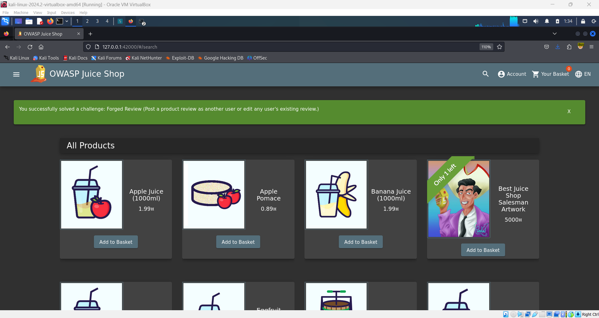

# Forged Review 🖋️

**Objective:**

Post a product review as another user or edit any user's existing review.

## Steps to Complete:

1. **Log In and Submit a Review:**

   - Log into your account and submit a review for any product.

2. **Enable Burp Suite Interception:**

   - Turn on interception in Burp Suite.
   - Enable Burp on FoxyProxy.

3. **Submit a New Review:**

   - On the same product, submit a second review.
   - Capture the request using Burp Suite when you hit **Submit**.

4. **Modify the Author:**

   - In the captured request, locate the `author` field.
   - Change the email in the `author` field to an email of another user (one that is not logged in).

5. **Forward the Request:**
   - Forward the modified request in Burp Suite.

## Completion:

After submitting the modified review as another user, you will pass the challenge and receive a green flag.

