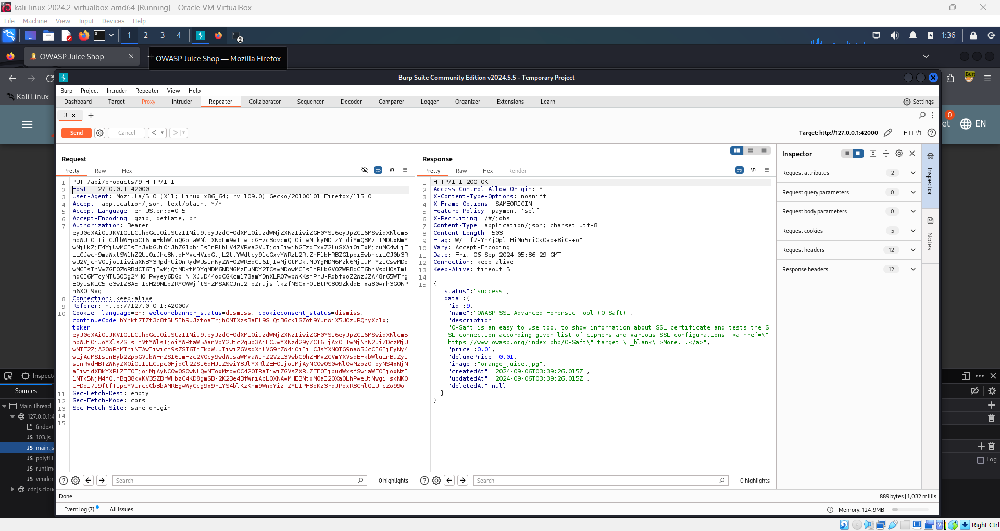

# Product Tampering 🛠️

**Objective:**

Change the href of the link within the **OWASP SSL Advanced Forensic Tool (O-Saft)** product description to `https://owasp.slck.com`.

## Steps to Complete:

1. **Enable Interception:**

   - Turn on interception in Burp Suite.
   - Enable Burp on FoxyProxy.

2. **Search for the Product:**

   - Use the **Search** feature on the navbar and search for the term "forensic."

3. **Inspect the Page:**

   - Inspect the page to find the `main.js` file.
   - Copy the content of the `main.js` file and paste it into an online editor like [js-beautify.io](https://js-beautify.io) to make the content easier to read.

4. **Locate the Product API:**

   - In the beautified content, search for the term "product" until you find the line `/api/products/9` (likely around line 1005).

5. **Modify the Request in Burp Suite:**

   - Burp Suite should have captured the search request in the **Proxy** tab.
   - Go to the **Repeater** tab and modify the captured request.
   - Change the request method from:

     ```
     GET /rest/products/search?q=forensic HTTP/1.1
     ```

     to:

     ```
     PUT /api/products/9 HTTP/1.1
     ```

     

6. **Change the Product Description:**

   - Modify the product description by changing the `href` in the request’s description field to `https://owasp.slck.com`.

7. **Set Content-Type:**

   - Add the following header to the request:

     ```
     Content-Type: application/json
     ```

8. **Send the Modified Request:**
   - After making the changes, click **Send** in the **Repeater** tab.
   - You should receive a success response indicating the link has been modified.

## Completion:

Successfully changing the `href` link in the product description will complete the challenge and reward you with a green flag.
