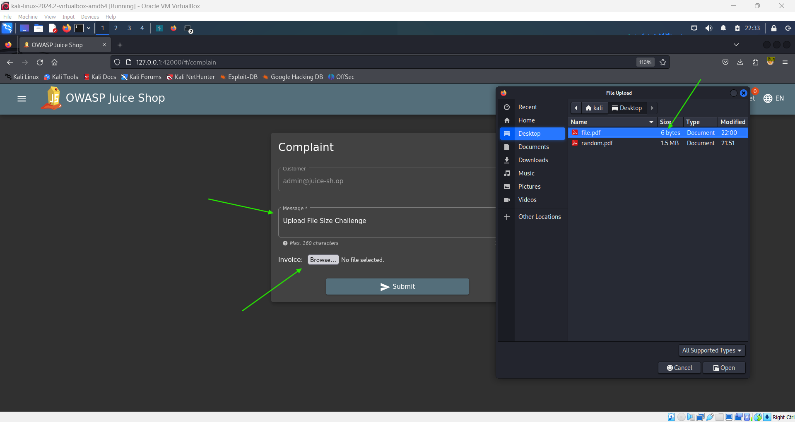
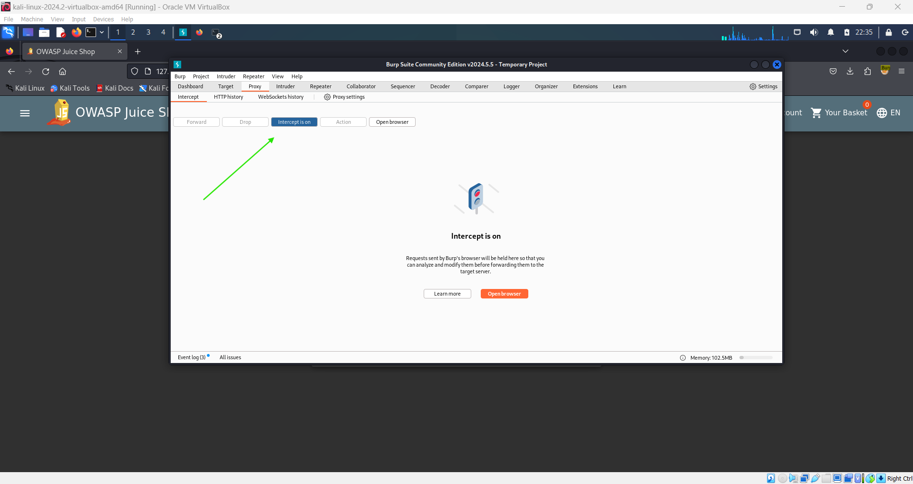
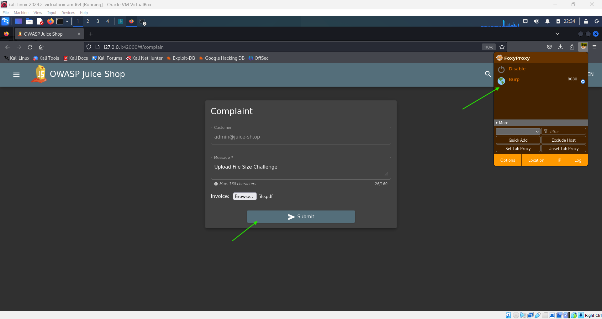
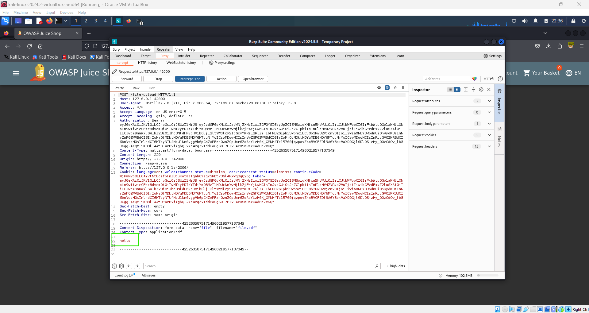
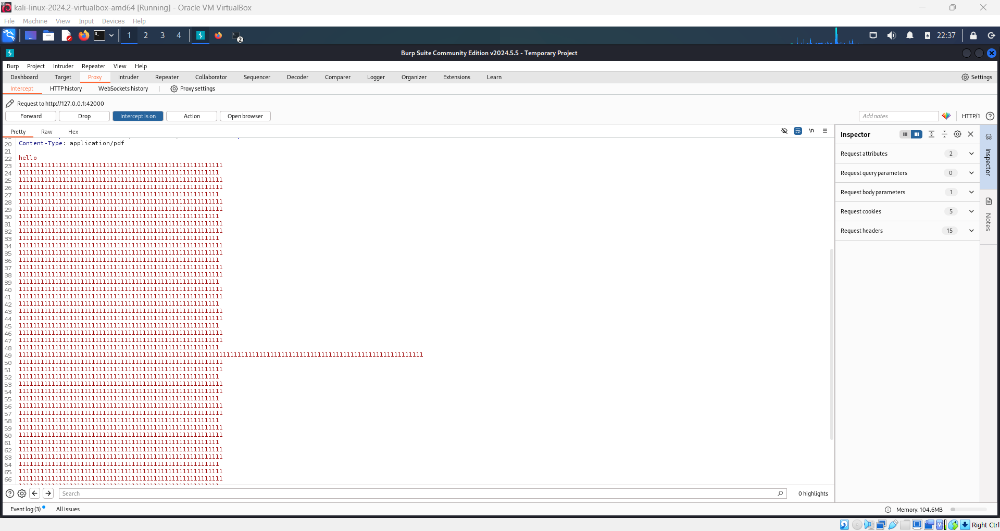

# Upload Size 📁

**Objective:**

Upload a file that is larger than 100KB by modifying the content.

## Steps to Complete:

1. **Log In:**

   - Log into your account.

2. **Access the Complaint Page:**

   - Navigate to the **Complaint** page.
   - Fill in the message field.

3. **Upload a Small PDF:**

   - For the **Invoice** input, browse and select a PDF file that is **less than 100KB**.

     

     

4. **Submit the Complaint:**

   - Submit the complaint form.

     

5. **Intercept the Request:**

   - Capture the request in Burp Suite when submitting the form.

     

6. **Modify the File Size:**

   - In Burp Suite, modify the captured request by adding random text to the content, artificially increasing the file size beyond 100KB.

     

7. **Forward the Modified Request:**
   - Forward the modified request to bypass the 100KB upload limit.

## Completion:

After successfully submitting the larger file, the challenge will be completed, and you will receive a green flag.
