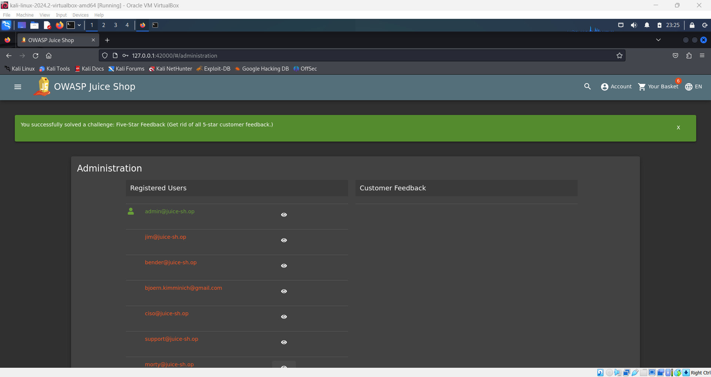

# Five-Star Feedback Challenge

This challenge is about getting rid of all 5-star customer feedback.

1. **Navigate to Feedback Section**:

   - Go to the relevant section where customer feedback is displayed. This is usually found under a feedback or reviews tab in the administration panel.

2. **Remove Feedback**:

   - Locate the specific customer feedback you want to remove or you can remove all of them. Look for an option to delete or remove feedback, such as a trash can icon or a delete button.
   - Click the delete option to remove the feedback.

3. **Confirm Removal**:

   - If prompted, confirm that you want to delete the feedback.

   
