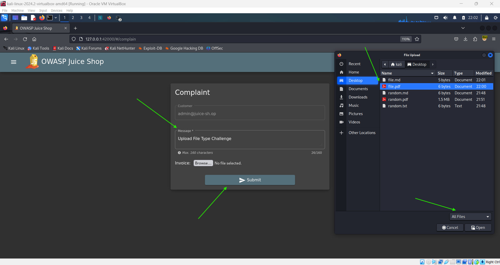
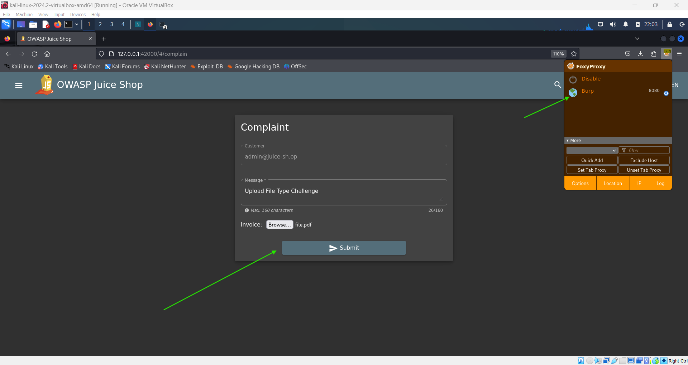
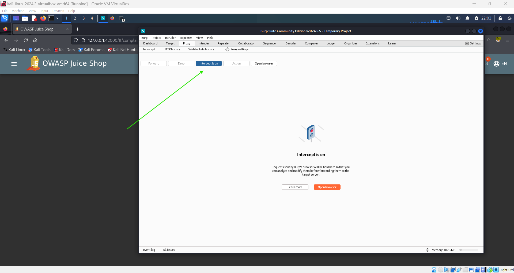
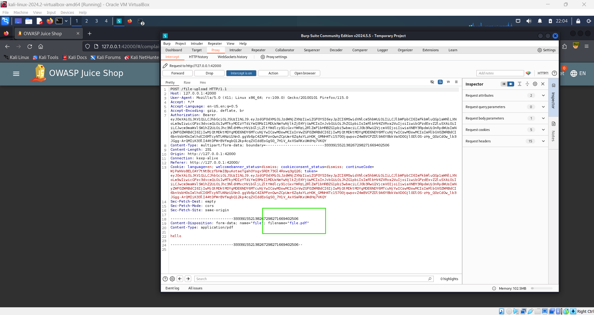
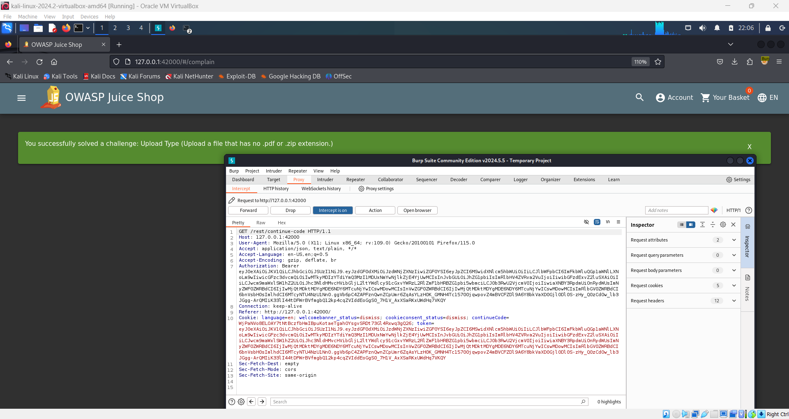

# Upload Type 📤

**Objective:**

Upload a file that does not have a `.pdf` or `.zip` extension.

## Steps to Complete:

1. **Log In:**

   - Log into your account.

2. **Access the Complaint Page:**

   - Navigate to the **Complaint** page.
   - Fill in the message field.

3. **Upload a PDF or ZIP file**

   - For the **Invoice** input, browse and select a PDF file or ZIP file that is **less than 100KB**.

     

     

     

4. **Submit the Complaint:**

   - Submit the complaint form.

5. **Intercept the Request:**

   - Capture the request in Burp Suite when submitting the form.

   

6. **Modify the File Size:**

   - In Burp Suite, modify the captured request by changing the file format, artificially changing the file format.

     

7. **Forward the Modified Request:**
   - Forward the modified request to bypass the format upload limit.

## Completion:

Successfully submitting a file without a `.pdf` or `.zip` extension will complete the challenge, earning you a green flag.

