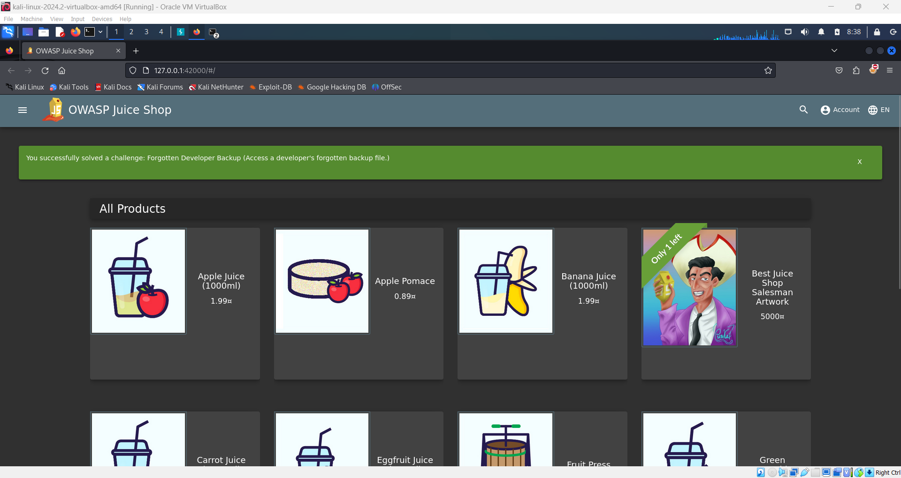

# 🗂️ Forgotten Developer Backup Challenge

In this challenge, your goal is to access a developer's forgotten backup file.

**Steps to solve the challenge:**

1. Go to the FTP page at:
   ```
   http://127.0.0.1:42000/#/ftp
   ```
2. Try to download the `package.json.bak` file. You'll receive an error stating that only `.md` and `.pdf` files are allowed.
3. To bypass this restriction, append `%00.md` (a null byte injection) to the file name on the error page.
4. If you encounter a "Bad Request" error, try using another encoding:
   ```
   %25%30%30.md
   ```
   This is the URL encoding of `%00`.
5. Append this encoded string to the file name and remove the `%00.md`.
6. You will successfully download the backup file and pass the challenge.


