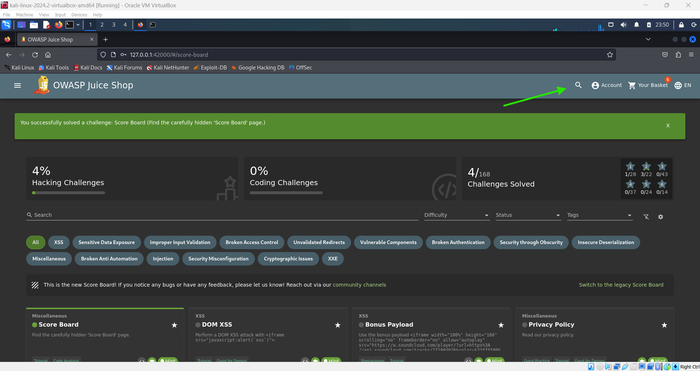
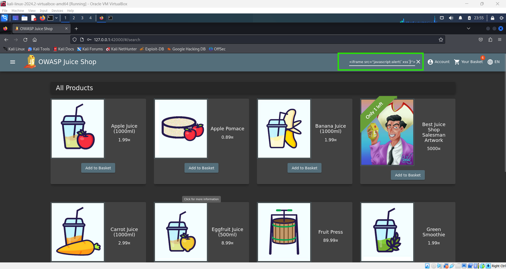
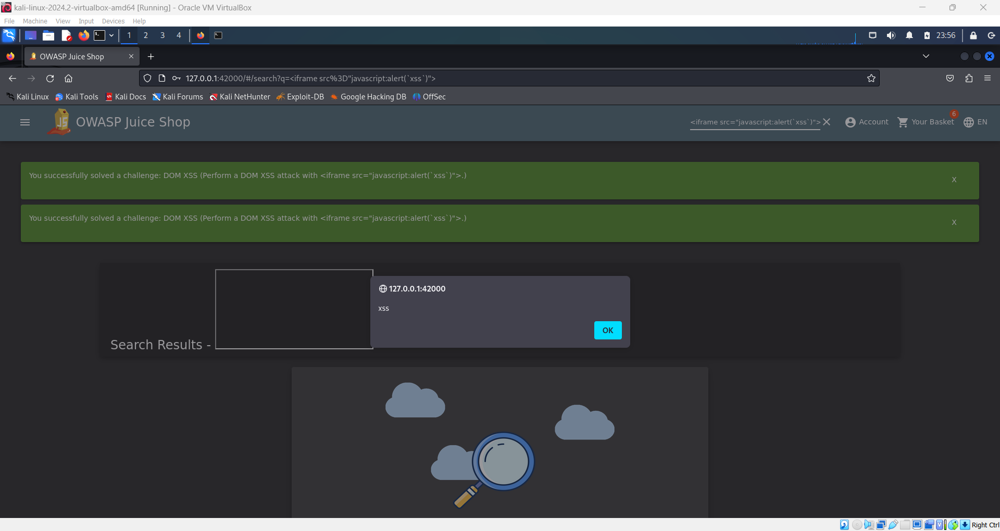

# DOM XSS Challenge 💉

**Objective**: Perform a DOM-based Cross-Site Scripting (XSS) attack. DOM XSS occurs when a web application’s client-side scripts manipulate the DOM in a way that allows an attacker to inject malicious code, which is then executed by the browser.

**Steps to Perform the Challenge**:

1. **Navigate to the Search Function**:

   - Go to the website's navbar.
   - Click on the **Search** button.

   

2. **Inject Malicious Code**:

   - In the search input field, type the following code:
     ```html
     <iframe src="javascript:alert('xss')"></iframe>
     ```
   - Press **Enter** or submit the search.

   

3. **Observe the Result**:

   - This should trigger a JavaScript alert showing `xss`, indicating that the DOM XSS attack was successful.

   
