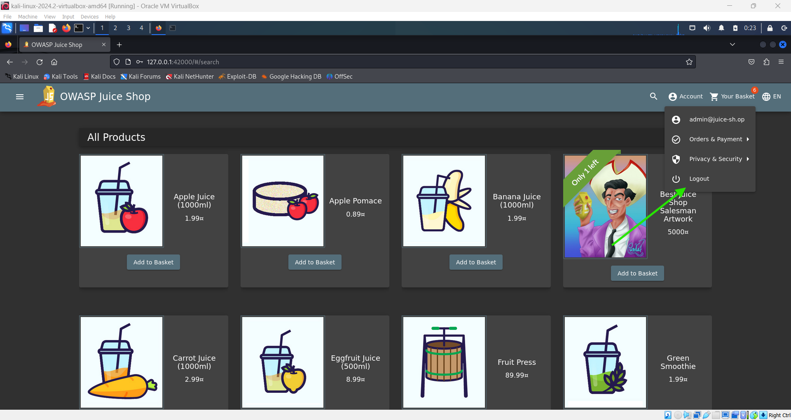
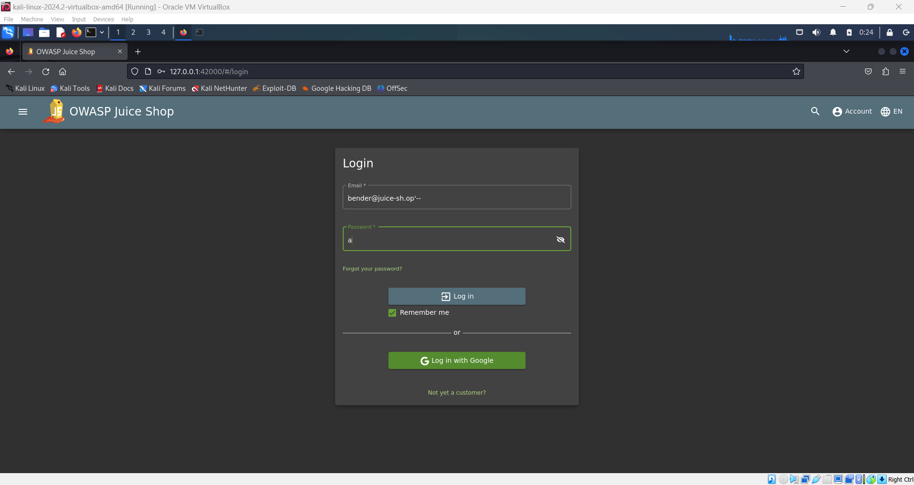
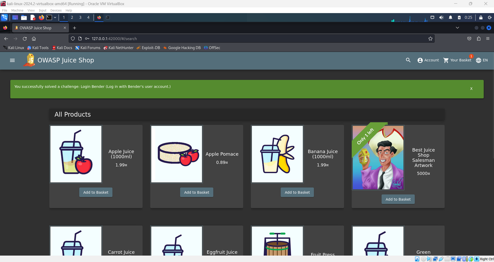

# Login Bender Challenge 🔐

**Objective**: Log in using Bender's account.

### Steps:

1. **Logout from Current Account**:

   - Navigate to the navbar.
   - Click on the **Account** button.
   - From the dropdown menu, select **Logout**.

   

2. **Enter Credentials**:

   - In the username field, enter:
     ```plaintext
     bender@juice-sh.op'--
     ```
   - For the password, use a random value (e.g., `a`).

     

3. **Access Benders Account**:

   - Submit the login form. This will successfully log you in as an Bender.

   
