# Password Strength Challenge 🔑

**Objective**: This challenge objective is to log in with the administrator's user credentials without previously changing them or applying SQL Injection.
We will achieve this by brute forcing the password for the administrator's account.

### Steps:

1. **Setup Burp Suite**:

   - Open Burp Suite in Kali Linux.
   - Navigate to the **Proxy** section and turn on **Intercept**.

   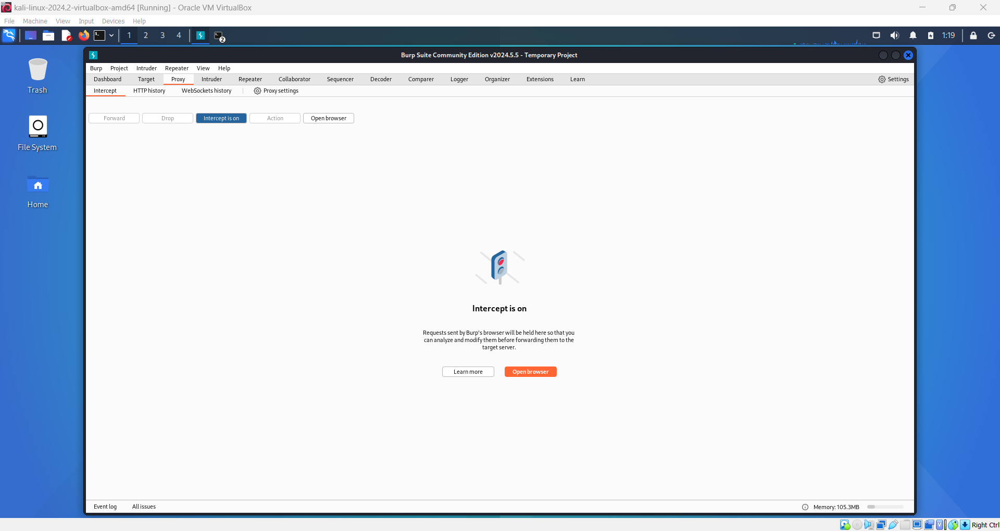

2. **Configure Proxy Settings in Browser**:

   - Open your browser and go to the proxy settings extension (e.g., FoxyProxy Standard).
   - Select the option for port **8080**. If it isn't available, add it manually:

     

   - Click the **Add Options** button in the extension popup.

     

   - Go to **Proxies** and click **Add**.

     

   - Name the proxy (e.g., `Burp`).
   - Set **Hostname** to `127.0.0.1` and **Port** to `8080`.
   - Save the configuration.

     

     

3. **Locate Administrator's Email**:

   - Visit the homepage of the Juice Shop.
   - Open the **Apple Juice** card and find the administrator's email under the **Reviews** section: `admin@juice-sh.op`.

     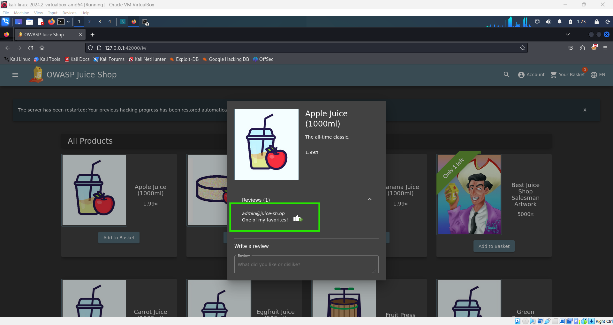

4. **Enable Burp Suite Proxy**:

   - Activate Burp Suite proxy in your browser by selecting the Burp option from the FoxyProxy extension.

     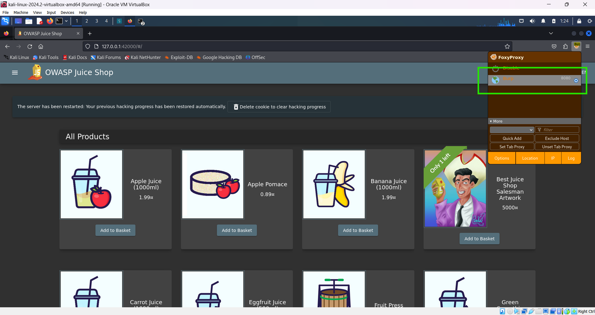

5. **Perform Brute Force Attack**:

   - Navigate to the login page of the Juice Shop.
   - Enter the administrator's username (`admin@juice-sh.op`) and a placeholder password (e.g., `a`), then click **Login**.

     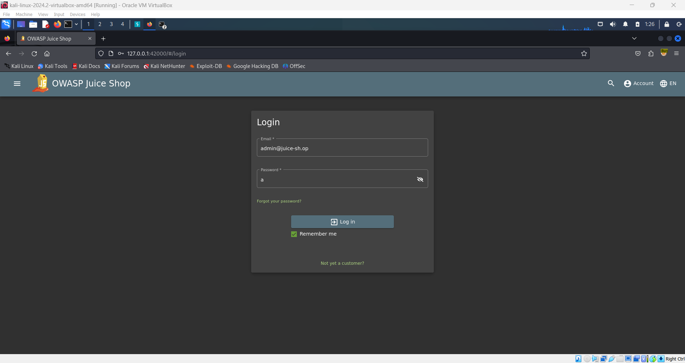

   - In Burp Suite, go to the **Intercept** tab. You should see the login request.

     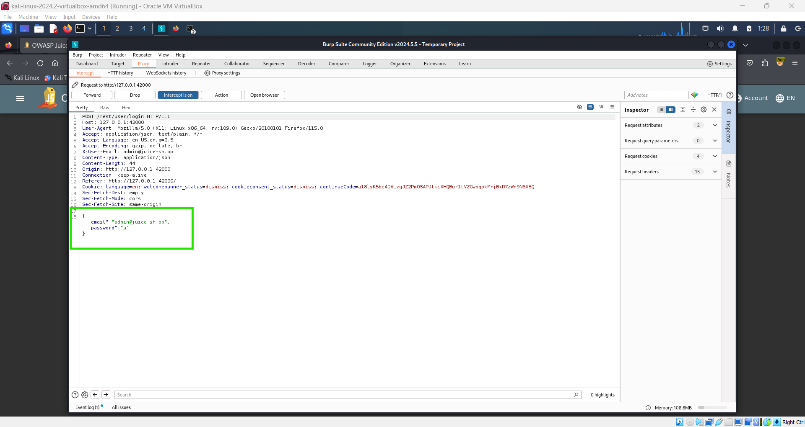

   - Click the **Action** button on the intercept page and select **Send to Intruder**.

     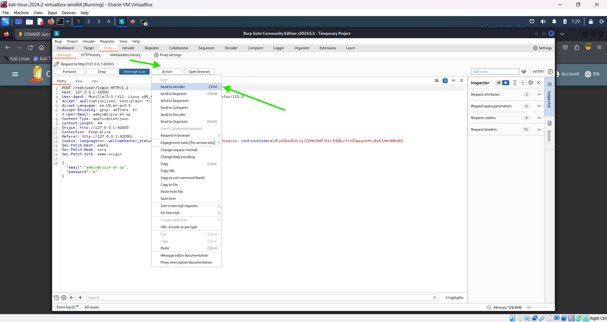

6. **Configure Intruder Attack**:

   - Go to the **Intruder** tab.
   - Click the **Clear** button on the right side.

     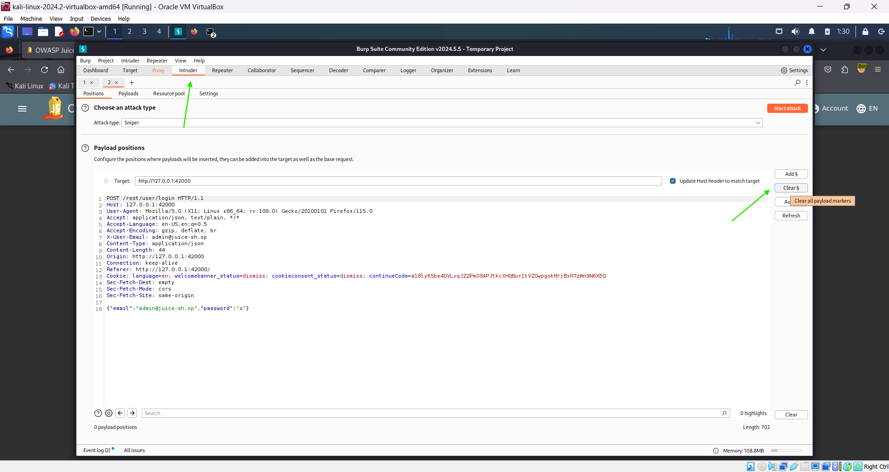

   - Set up the payload positions by changing the password in the request to `"§§"`. And also make sure to clear the password input field from the login form.

     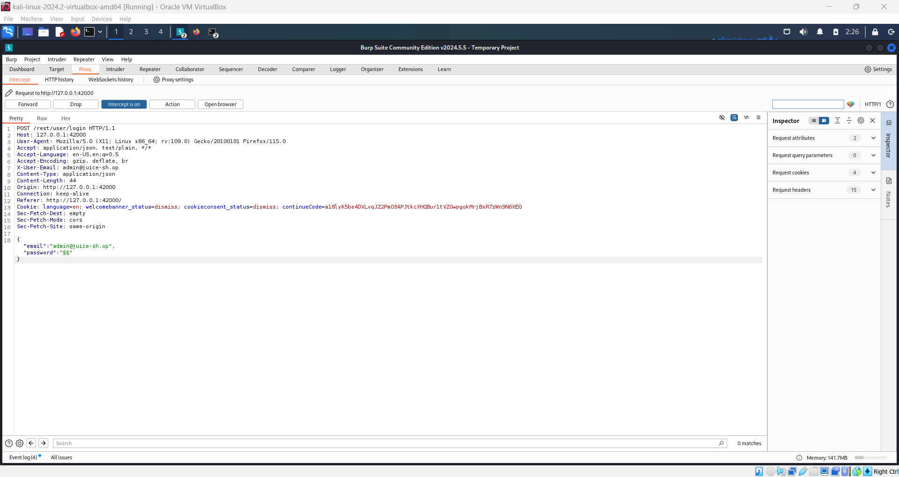

   - For the payload, use the `best1050.txt` file from Seclists. Install Seclists if needed with:

     ```bash
     sudo apt-get install seclists
     ```

     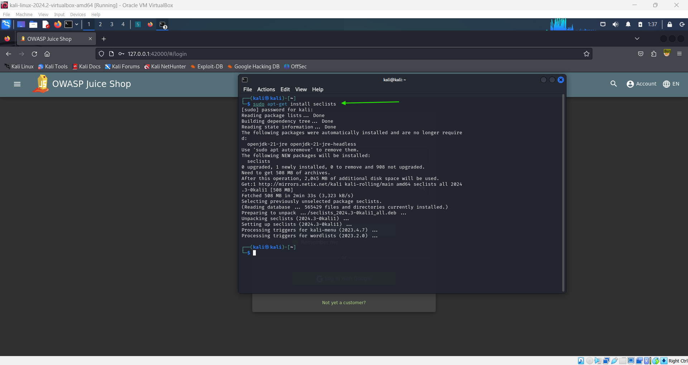

   - Load the wordlist from `/usr/share/wordlists/SecLists/Passwords/Common-Credentials/best1050.txt`.

     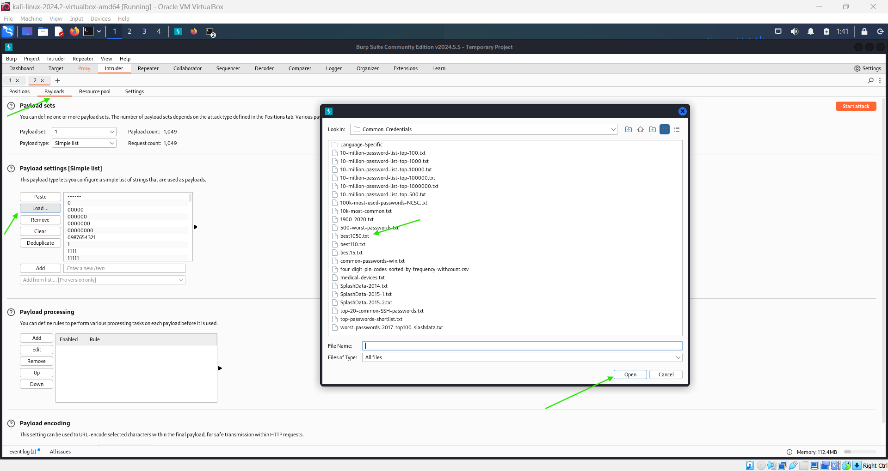

7. **Start the Attack**:

   - Start the attack in Burp Suite.

   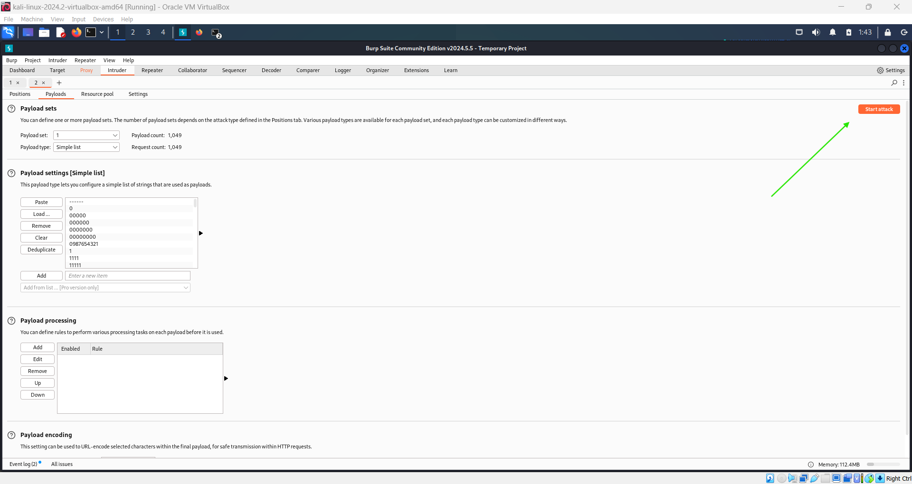

   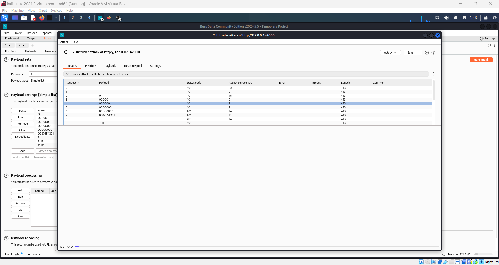

   - Filter the results by status codes:

     - A **401 Unauthorized** response indicates a failed attempt.
     - A **200 OK** response indicates a successful login.

       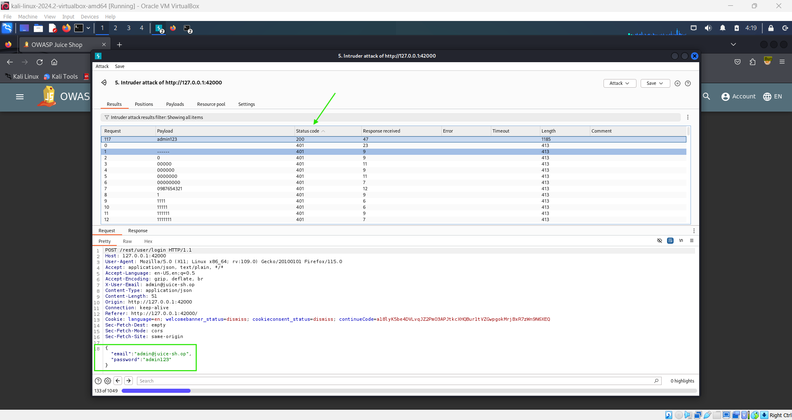

8. **Login with Found Password**:

   - Once you find the correct password, exit the attack page.

     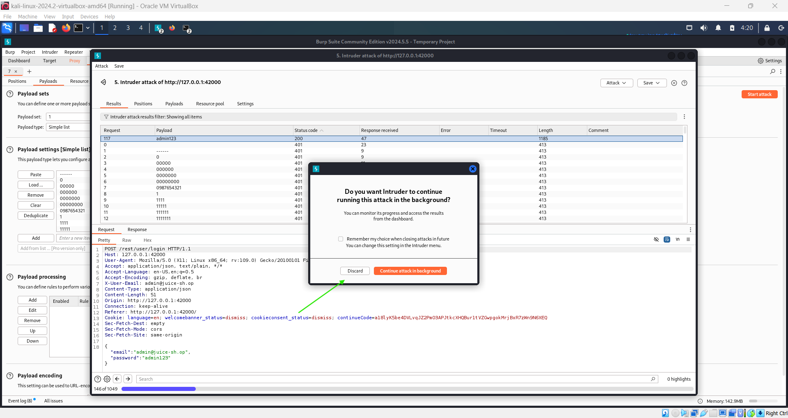

   - Go to the Juice Shop and log in with the administrator account using the discovered password.
   - Disable Burp Suite proxy in FoxyProxy since we no longer need to intercept traffic.

     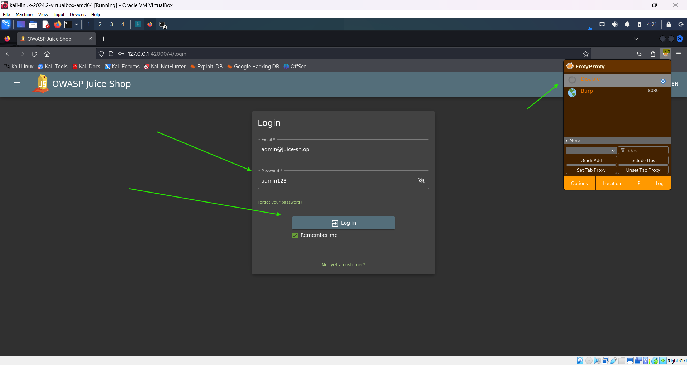

9. **Complete the Challenge**:

   - Successfully log in to the administrator's account with the obtained password.

     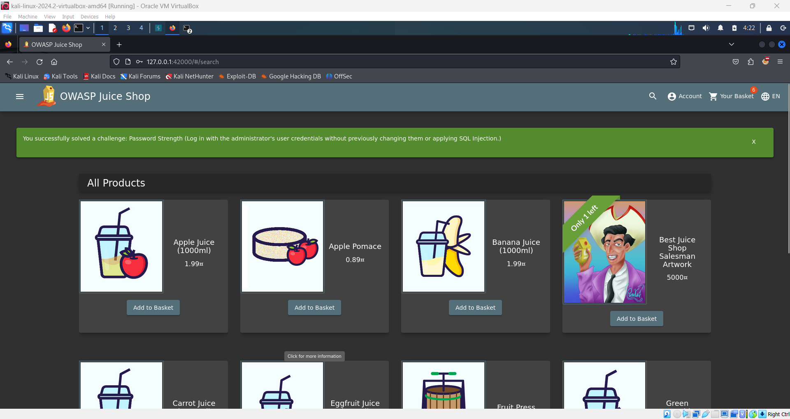
