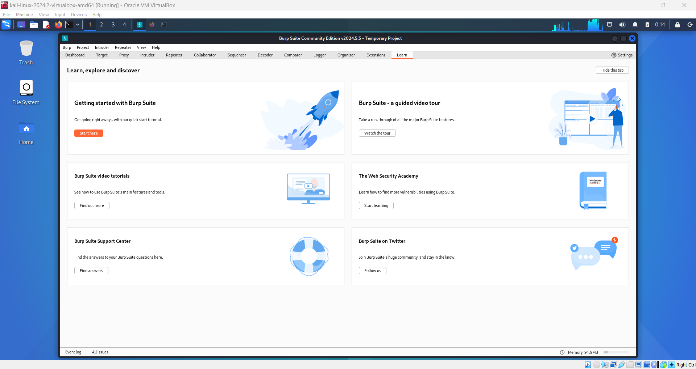

# Installing Burp Suite on Kali Linux

**Burp Suite** is an integrated platform for performing security testing of web applications. It provides various tools that work together to support the entire testing process, from mapping and analyzing an application’s attack surface to finding and exploiting security vulnerabilities. Burp Suite combines advanced manual techniques with state-of-the-art automation, making your work faster, more effective, and more enjoyable.

**Installed Size**: 262.02 MB

## Installation Steps

1. **Update Your System**:

   - Open a terminal and ensure your system is up-to-date:
     ```bash
     sudo apt update && sudo apt upgrade
     ```

2. **Install Burp Suite**:

   - Install Burp Suite using the following command:
     ```bash
     sudo apt install burpsuite
     ```

3. **Run Burp Suite**:
   - After installation, you can launch Burp Suite from the applications menu or by running:
     ```bash
     burpsuite
     ```
     
